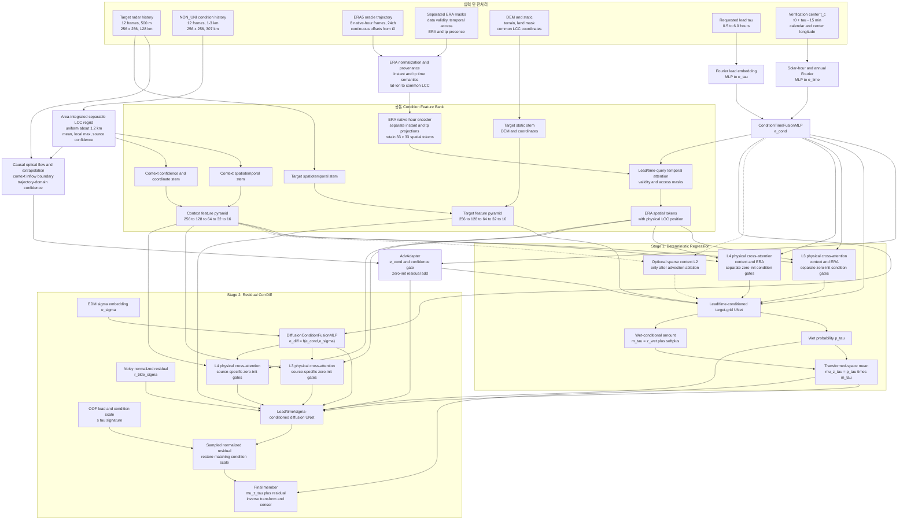
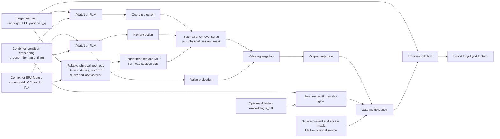
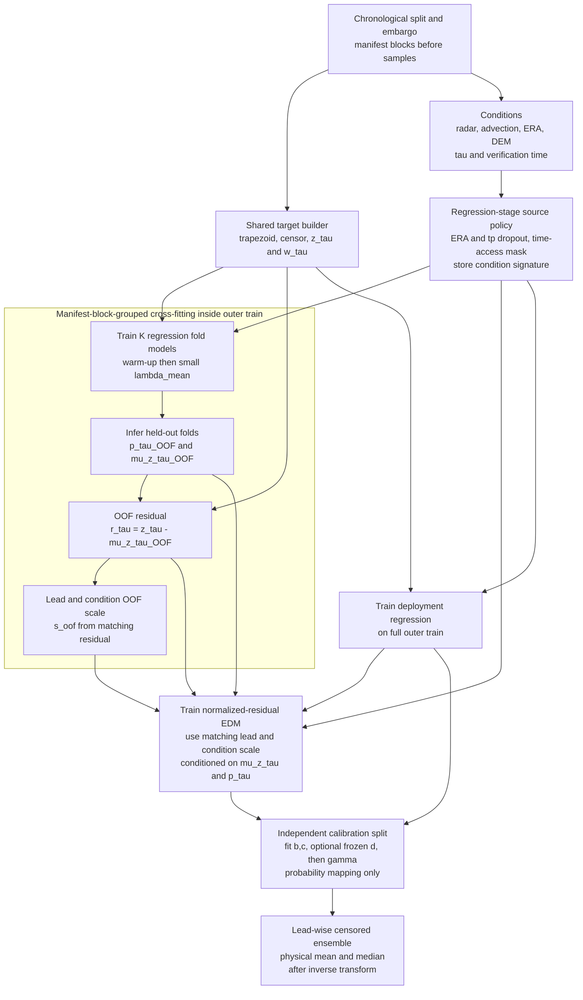
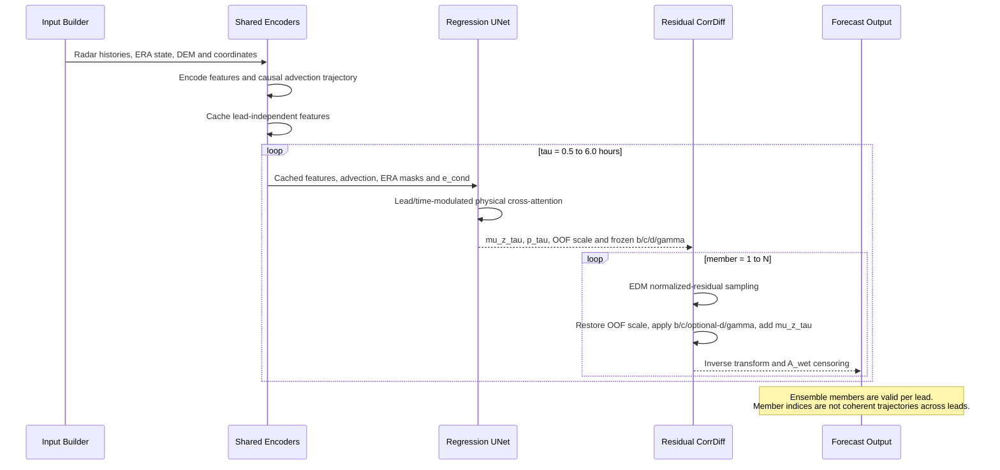

# K-CorrDiff Phase 1 Architecture v1.1.3b

> 상태: v1.1.3b pre-freeze 아키텍처·학습·calibration 명세 — release candidate, §29 freeze ledger의 blocking 해소 시 동결 확정  
> 범위: 0.5–6시간 리드별 30분 누적강수 확률예보  
> 핵심 구조: lead-conditioned deterministic regression + OOF residual CorrDiff  
> 평가 규약: [K-CorrDiff v1.1.3b Evaluation Protocol](./k_corrdiff_evaluation.md)

## 1. 설계 요약

하나의 공유 모델이 요청받은 리드타임 `tau`에 해당하는 30분 누적강수장 한 장의 조건부 분포를 예측한다.

```text
f(condition, tau, verification_time, noise)
    -> 30-minute accumulated precipitation ending at t0 + tau
```

Phase 1의 주요 결정은 다음과 같다.

1. 출력 시간축을 모델의 출력 채널로 두지 않고 리드타임 `tau`를 입력 조건으로 사용한다.
2. 출력은 `t0+tau`에 끝나는 30분 누적강수 `256 x 256`, 500 m 격자다.
3. 고해상도 target 레이더와 광역 condition 레이더는 서로 다른 encoder로 처리한다.
4. NON_UNI condition은 약 307 km 영역을 유지한 채 `256 x 256`, 약 1.2 km 균일 LCC 격자로 area-integrated 리그리드한다.
5. target과 context feature의 결합은 배열 인덱스가 아니라 공통 LCC 물리좌표를 사용하는 cross-attention으로 수행한다.
6. target stream에는 DEM, 지형 파생변수, land/sea mask와 LCC 좌표를 정적 조건으로 넣는다.
7. context와 ERA5의 cross-attention에는 source별 zero-init gate와 lead·verification-time 변조를 적용한다.
8. 30분 누적강수는 `A_wet = 0.1 mm/30min` 미만을 0으로 censoring하여 `w_tau=0`과 `z_tau=0`을 정확히 일치시킨다.
9. 첫 단계는 wet probability와 support-constrained wet 조건부 transformed amount `m_tau=z_wet+softplus(raw)`를 분리하고 `mu_z_tau = p_tau * m_tau`로 transformed-space 조건부 평균을 구성한다.
10. 두 번째 CorrDiff는 OOF regression prediction으로 만든 잔차를 lead·condition-signature별 scale로 정규화해 생성하며, `mu_z_tau`와 `p_tau`를 직접 조건으로 받는다.
11. 과거 레이더로 만든 causal advection forecast를 단기 예측의 물리 anchor이자 필수 baseline으로 사용한다.
12. ERA5는 `tp`를 포함한 24채널로 고정하며, 미래 ERA5 trajectory를 사용하는 결과는 모두 retrospective oracle로 표기한다.
13. 임의의 5분 `t0`를 지원하기 위해 UTC native-hour 8장과 연속 시간 offset을 사용하고, 실제 결측·의도적 시간 접근·source 존재 mask를 분리한다.
14. ERA source 및 `tp` dropout은 regression 학습부터 적용하고 동일 condition signature를 diffusion까지 전달한다.
15. ERA5 spatial token은 기본적으로 원래 `33 x 33` 공간해상도를 유지하고 채널만 압축한다.
16. Full-trajectory ERA5, target-end-causal ERA5와 operational-provider hindcast를 서로 다른 provider track으로 평가한다.
17. Context L2 fusion은 advection 적용 후에도 단기 경계 유입 위상오차가 남을 때만 sparse/local 방식으로 추가한다.
18. 검증구간 중심 `t_c=t0+tau-15 min`의 mean-solar hour와 annual phase에서 `e_time`을 만들고 `e_tau`와 결합해 모든 AdaLN/FiLM, temporal query와 source gate를 변조한다.
19. `e_time`은 `t0`, `tau`와 고정 target-center longitude만으로 계산되는 deterministic exogenous condition이며 ERA/tp dropout, temporal-access mask와 condition signature에 포함하지 않는다.
20. CPrecNet archive는 0.5–6시간 event-conditioned pretraining에 사용하고, 최종 0–6시간 학습과 보정에는 continuous KMA HSR timeline을 필수로 사용한다.
21. Phase 1 ensemble은 리드타임별 주변분포를 표현하며, 서로 다른 리드의 같은 member 번호가 하나의 연속 시나리오를 뜻하지 않는다.
22. 모든 구조·fold·solver 선택은 고정 `16x8` signature의 model-selection validation에서 끝내고, calibration은 사전 고정 `32x12` final signature의 residual·spread·probability mapping만 fit한다.
23. 미래 `M_target_tau`는 target-dependent loss·calibration objective·metric에만 사용하고 model condition과 inference API에서는 배제한다.

## 2. 예측 문제 정의

### 2.1 리드타임

기본 리드타임은 30분 단위 12개다.

```text
tau in {0.5, 1.0, 1.5, ..., 6.0 hours}
```

각 출력은 다음 구간의 누적강수다.

```text
tau = 0.5 h : (t0,       t0 + 0.5 h]
tau = 1.0 h : (t0+0.5 h, t0 + 1.0 h]
...
tau = 6.0 h : (t0+5.5 h, t0 + 6.0 h]
```

### 2.2 30분 누적 타깃의 시간 규약

HSR은 timestamp별 순간 합성반사도장에 가까우므로, 기본 30분 raw 누적강수는 7개 scan을 사용하는 trapezoidal 적분으로 정의한다.

```text
t_start_tau = t0 + tau - 30 minutes
t_end_tau   = t0 + tau
delta = 5 / 60 hours
```

선형 강수강도 `R`에서 타깃은 다음과 같다.

```text
A_raw_tau = delta * (
    0.5 * R(t_start_tau)
    + R(t_start_tau + 5 min)
    + R(t_start_tau + 10 min)
    + R(t_start_tau + 15 min)
    + R(t_start_tau + 20 min)
    + R(t_start_tau + 25 min)
    + 0.5 * R(t_end_tau)
)
```

인접한 30분 구간은 경계 scan을 절반씩 공유하므로 12개 구간을 합하면 동일한 trapezoidal 규약의 6시간 총누적과 일치한다.

v1.1.3b의 누적 규약은 trapezoid로 고정한다. HSR scan의 시간 의미(순간 합성장 여부)는 manifest 생성 전에 KMA 포맷 문서와 데이터위키로 확인하고 확인 일자·근거를 data-contract 기록에 남기며, 이 확인은 §20 Step 1의 blocking 항목이다. 확인 결과 각 scan이 직전 5분 구간의 대표 강수강도로 판명되는 경우에만 다음 right-endpoint 규약으로 교체하고, 교체는 target·OOF artifact·calibration 전체 재생성이 필요한 protocol version 변경으로 취급한다.

```text
A_raw_tau = delta * sum(R(t_start_tau + 5*k minutes), k=1..6)
```

타깃 생성, regression 학습, diffusion residual 생성과 사후 물리단위 복원은 하나의 공통 `build_accumulation_target()` 구현을 사용한다. 누적 전에 CPrecNet normalized/log 값을 반드시 `R(mm/h)` 선형공간으로 역변환한다.

```text
if v == 0:
    R = 0
else:
    R = 10 ** ((45 * v - 15) / 10)  # mm/h
```

30분 raw 누적 `A_raw_tau`를 만든 뒤, wet 기준과 transformed target을 다음 순서로 고정한다.

```text
A_wet       = 0.1 mm/30min
w_tau       = 1[A_raw_tau >= A_wet]
A_model_tau = A_raw_tau * w_tau
z_tau       = log1p(A_model_tau / A0)
```

`A_raw_tau`는 자료 진단과 threshold 민감도 분석을 위해 보존하지만, v1.1.3b의 regression과 diffusion 타깃은 `A_model_tau`다. 이 정의로 `w_tau=0`이면 정확히 `z_tau=0`이고, `w_tau=1`이면 `z_tau>0`이다. 검증 관측에도 같은 censoring을 적용한다.

`A0 = 1 mm`로 두고 모든 transform 통계는 train split에서만 계산해 고정한다. Regression mean과 diffusion residual은 모두 동일한 `z` 공간에서 정의한다. `A_wet` 또는 `A0`를 바꾸면 기존 checkpoint와 호환되지 않는 데이터 계약 변경으로 취급한다.

Wet support의 transformed-space 하한도 데이터 계약에 포함한다.

```text
z_wet = log1p(A_wet / A0) = log1p(0.1) ~= 0.09531
w_tau = 1  =>  z_tau >= z_wet
```

결측 정책은 timestamp 단위 결측과 pixel QC 결측을 분리해 고정한다.

```text
target timestamp scan 7개 중 하나라도 전체 부재: sample drop
scan은 존재하지만 pixel QC invalid:
    M_target_tau(x,y) = 1 only if the pixel is valid in all 7 scans
    M_target_tau=0 pixel은 target-dependent loss, calibration과 metric에서 제외
결측 scan을 0으로 대체: 금지
6개만 합산한 뒤 시간 재정규화: 금지
input-history timestamp scan 12개 중 전체 부재: MVP에서는 sample drop
input pixel QC invalid: explicit history-validity channel로 전달
```

`M_target_tau`는 미래 7개 target scan에서 계산되므로 예보 발행시각에 알 수 없다. Target label이 필요한 training/calibration objective와 verification denominator에만 사용할 수 있으며 regression/diffusion condition, feature cache와 inference API에는 절대 전달하지 않는다. `t<=t0`의 input-history validity와 발행시점에 알려진 static coverage mask는 각각 `M_history`, `M_static_coverage`라는 별도 이름으로만 condition에 사용할 수 있다.

Pixel QC invalid의 판정은 지금까지 파생량(`M_target_tau`, `rho_invalid_max`)의 전제였으나 정의되지 않았던 원시 계약이며, source별로 다음처럼 고정한다.

```text
continuous KMA HSR (final training, calibration, serving):
    per-scan pixel valid =
        raw int16 값이 결측/차폐 sentinel code 집합에 속하지 않음
        AND M_static_coverage(x,y) = 1
    sentinel code 집합은 KMA 포맷 문서와 원자료 실측 대조로
    manifest 생성 전에 한 번 확정하고 config hash에 포함

CPrecNet Dataverse archive (pretraining):
    전처리가 무에코·미달·결측을 모두 0으로 병합하므로
    per-pixel dynamic validity가 존재하지 않음
    M_target_tau(x,y) := M_static_coverage(x,y)로 강등
    이 한계는 event-conditioned pretraining 범위에서만 허용하고
    §18.1에 pretraining 한계로 기록
```

`context_localmax_R`, significant wet component와 모든 manifest seed 계산은 sentinel 제외를 먼저 적용한 뒤 수행한다. Sentinel 집합 확정 전에 생성한 manifest는 공식본으로 삼지 않는다.

`rho_invalid_max`는 **outer-train의 regression, OOF와 diffusion 학습 sample 선정에만** 적용한다. 허용 최대 invalid fraction은 continuous outer-train QC 통계만으로 model-selection 전에 고정하고 config hash에 포함한다. `invalid_fraction > rho_invalid_max`인 outer-train item은 학습에서 제외할 수 있고, 허용 범위 안의 sparse invalid pixel만 loss에서 제외한다.

Model-selection validation, calibration과 final test에서는 `rho_invalid_max`를 근거로 sample 전체를 제거하지 않는다. Timestamp scan 전체가 부재한 경우만 기존 계약대로 sample을 제외하고, scan은 존재하지만 pixel QC가 invalid이면 `M_target_tau=0` pixel만 objective·metric denominator에서 제외한다. 각 split과 lead에서 `rho_invalid_max` 초과 sample 비율과 valid-area 분포를 별도 보고하며, calibration/test 결측률을 본 뒤 threshold를 바꾸지 않는다.

NPZ key 부재는 실제 무강수를 뜻하지 않을 수 있으므로 결측과 dry를 절대 같은 값으로 취급하지 않는다.

### 2.3 확률모형

조건 전체를 `C`, censored 누적강수의 학습공간 값을 `z_tau`, wet indicator를 `w_tau`라고 한다. Regression 단계는 다음 두 값을 예측한다.

```text
p_tau = P(w_tau = 1 | C, tau)
m_tau = E[z_tau | w_tau = 1, C, tau]
mu_z_tau = p_tau * m_tau = E[z_tau | C, tau]
```

`w_tau=0`일 때 `z_tau=0`이므로 마지막 항등식이 정확히 성립한다.

CorrDiff 단계의 잔차는 다음과 같다.

```text
r_tau = z_tau - mu_z_tau(C)
```

Diffusion은 raw `m_tau`가 아니라 학습된 transformed-space 평균 `mu_z_tau`와 wet probability `p_tau`를 받아 다음 조건부 잔차분포를 학습한다.

```text
p(r_tau | C, mu_z_tau, p_tau, tau)
```

최종 ensemble member는 다음과 같다.

```text
z_hat_tau^(n) = mu_z_tau + r_hat_tau^(n)
```

`mu_z_tau`는 `E[z_tau | C, tau]`이지 물리단위 평균 `E[A_model_tau | C, tau]`가 아니다. `expm1`이 볼록하므로 다음 deterministic mapping은 일반적으로 물리단위 조건부 평균보다 작다.

```text
A_reg_zinv_tau = A0 * expm1(mu_z_tau)
```

`A_reg_zinv_tau`는 일반적으로 물리단위 조건부 평균도 중앙값도 아니다. Wet 조건부 transformed amount의 역변환 `A0*expm1(m_tau)`조차 `z|wet,C,tau`가 대칭에 가까울 때에만 wet-conditional 중앙값 근사로 해석할 수 있으며, `A_reg_zinv_tau`는 그 값과도 다르다. 최종 물리단위 평균과 중앙값은 각 ensemble member를 역변환하고 censoring한 뒤 member 축에서 각각 계산한다.

## 3. 입력과 출력 계약

| 구성요소 | 시간축 | 공간격자 | 대표 tensor shape | 역할 |
|---|---:|---|---|---|
| Target radar history | 과거 60분, 5분 간격 | 500 m, 256 x 256, 약 128 km | `[B, 12, C_rt, 256, 256]` | 국지 강수 구조와 이동 |
| Context radar history | 과거 60분, 5분 간격 | 리그리드 후 약 1.2 km, 256 x 256, 약 307 km | `[B, 12, C_rc, 256, 256]` | 광역 유입 강수와 주변 문맥 |
| Causal advection | `t0`부터 `t0+6 h`, 5분 간격 | context flow + 500 m target application | lead별 `[B, C_adv, 256, 256]` | 단기 이동·경계 유입의 물리 anchor |
| ERA5 trajectory | `floor_hour(t0_UTC)`부터 최대 `+7 h`, native-hour 8장 | 0.25도, 33 x 33 | `[B, 8, 24, 33, 33]` | 미래 대규모 대기환경의 retrospective oracle 조건 |
| ERA time metadata | ERA token 및 lead별 | 연속 시간 offset과 분리 mask | `[B, 8]` 각각 | `data_valid_inst`, `tp_valid`, `trajectory_window`, `temporal_access` 분리 |
| ERA source state | 샘플당 하나 | token 또는 condition signature | `[B, ...]` | provider, `era_present`, `tp_present`, access mode |
| Target static | 정적 | 500 m, 256 x 256 | `[B, C_st, 256, 256]` | DEM, 지형, 위치정보 |
| Context static | 정적 | 약 1.2 km, 256 x 256 | `[B, C_sc, 256, 256]` | 위치, 보간 신뢰도, 선택적 광역 DEM |
| Lead time | 샘플당 하나 | 스칼라 | `[B]` | 어떤 미래 구간을 예측할지 지정 |
| Verification-time condition | lead마다 하나 | `t_c`, mean-solar hour, annual phase | `[B, C_time]` | 일주기·계절 위상 `e_time`; 항상 존재 |
| Wet probability | 샘플당 한 장 | 500 m, 256 x 256 | `[B, 1, 256, 256]` | `p_tau` |
| Positive amount | 샘플당 한 장 | 500 m, 256 x 256 | `[B, 1, 256, 256]` | wet 조건부 평균 `m_tau` |
| Regression mean | 샘플당 한 장 | 500 m, 256 x 256 | `[B, 1, 256, 256]` | transformed-space mean `mu_z_tau = p_tau * m_tau` |
| Diffusion output | 멤버당 한 장 | 500 m, 256 x 256 | `[B, 1, 256, 256]` | lead-normalized stochastic residual |

`C_rt`, `C_rc`의 최소 구성은 강수강도 한 채널이지만, 다음 파생채널을 함께 사용할 수 있다.

```text
log-transformed rain rate
wet/dry mask
valid mask or valid fraction
```

## 4. 공간영역과 격자

### 4.1 Target grid

```text
shape: 256 x 256
spacing: 500 m
extent: 128 x 128 km
projection: KMA LCC
role: 최종 예측 및 diffusion state grid
```

Target grid는 전체 모델에서 유일한 생성 격자다. Regression mean, diffusion residual, 최종 강수 ensemble은 모두 이 균일 500 m 격자에 존재한다.

### 4.2 원래 NON_UNI condition grid

```text
shape: 256 x 256
spacing: 중앙 약 1 km, 외곽 최대 3 km
extent: 약 307 x 307 km
type: tensor-product non-uniform grid
```

원래 condition 중앙은 target의 1 km 다운샘플과 정확히 대응한다.

```python
condition[64:192, 64:192] == target[::2, ::2]
```

### 4.3 Uniform context grid

NON_UNI condition은 동일한 약 307 km 영역을 유지하면서 균일 격자로 변환한다.

```text
shape: 256 x 256
spacing: 약 1.2 km
extent: 약 307 x 307 km
projection: target과 동일한 KMA LCC
```

격자 중심의 처음과 마지막 위치를 유지하는 정의에서는 간격이 대략 다음과 같다.

```text
307 km / 255 intervals ~= 1.204 km
```

Condition이 tensor-product grid이므로 리그리드는 축별 1차원 연산으로 표현한다. 단순히 목적 격자 중심에서 값을 평가하는 point interpolation은 사용하지 않는다. 중앙의 `1 km -> 약 1.2 km` 구간에서 고주파 강수장의 aliasing을 막기 위해 source의 piecewise-linear field를 각 destination cell 구간에 대해 적분한다.

1차원 destination cell `j`와 source basis `i`의 weight는 다음과 같다.

```text
W[j,i] = (1 / destination_cell_width[j])
         * integral_over_destination_cell(phi_i(x) dx)
```

`phi_i`는 source point에 대응하는 piecewise-linear basis다. 2차원 연산은 다음과 같이 separable하게 적용한다.

```text
R_uniform = W_y @ R_nonuniform @ W_x^T
```

이 연산은 중앙의 downsampling에서는 antialiasing/면적평균 역할을 하고, 외곽의 `3 km -> 약 1.2 km` 구간에서는 piecewise-linear reconstruction 역할을 한다.

`W_x`, `W_y`는 모든 시각에 공통이므로 한 번 계산해 sparse operator로 저장한다. 연산은 normalized/log 값이 아니라 선형 `R(mm/h)` 공간에서 수행한 뒤 모델 입력 transform을 다시 적용한다.

Area-integrated mean만으로 작은 대류 core가 약해지는 것을 막기 위해 별도의 nearest 또는 local-max 채널을 유지한다.

```text
context dynamic channels:
- area-integrated mean R
- nearest-neighbor or local-max R
- wet mask
- valid fraction
```

리그리드 후 배열은 균일하지만 원본 관측 정보밀도는 여전히 위치에 따라 다르다. Context static 입력에 다음 정보를 유지한다.

```text
original source dx
original source dy
nearest source sample distance
interpolation confidence
valid fraction
```

## 5. 공통 물리좌표 체계

Target, context, DEM, ERA5 spatial token은 모두 동일한 LCC 기준으로 위치를 표현한다.

```python
x_shared = (x_lcc_km - target_center_x_km) / 100.0
y_shared = (y_lcc_km - target_center_y_km) / 100.0
```

두 스트림의 좌표를 각각 자기 영역 기준 `[-1, 1]`로 정규화하면 안 된다. Target 경계와 context 경계가 같은 수치로 매핑되어 실제 공간 대응이 사라지기 때문이다.

Encoder의 각 downsampling level에서도 다음 geometry metadata를 유지한다.

```text
token center x
token center y
token footprint width
token footprint height
valid fraction
```

예시 feature pyramid의 물리 간격은 다음과 같다.

| Level | Target shape | Target token spacing | Context shape | Context token spacing |
|---|---:|---:|---:|---:|
| L0 | 256 x 256 | 0.5 km | 256 x 256 | 약 1.2 km |
| L1 | 128 x 128 | 1 km | 128 x 128 | 약 2.4 km |
| L2 | 64 x 64 | 2 km | 64 x 64 | 약 4.8 km |
| L3 | 32 x 32 | 4 km | 32 x 32 | 약 9.6 km |
| L4 | 16 x 16 | 8 km | 16 x 16 | 약 19.2 km |

같은 tensor index와 같은 feature-map shape가 같은 물리위치를 의미하지 않으므로 target/context feature를 인덱스 기준으로 직접 concat하지 않는다.

## 6. Target radar 및 static branch

### 6.1 Dynamic target input

기본 target radar history는 과거 60분이다.

```text
X_target: [B, 12, C_rt, 256, 256]
```

시간정보를 처리하는 spatiotemporal stem의 권장 구성은 다음과 같다.

```text
factorized temporal-spatial convolution or shallow Conv3D
    -> temporal residual blocks
    -> temporal attention pooling
    -> 2D target feature map
```

과거 frame을 단순히 채널축에 쌓는 baseline도 가능하지만, 최종 구조에서는 시간 이동과 발달을 명시적으로 처리하는 temporal stem을 사용한다.

### 6.2 Target static input

Target static branch에는 다음 채널을 넣는다.

```text
DEM elevation
terrain slope x
terrain slope y
local terrain relief or DEM standard deviation
land/sea mask
x LCC coordinate
y LCC coordinate
```

정적장은 레이더 시간축마다 복제하지 않고 별도 static stem으로 한 번 인코딩한다. Target temporal feature와 static feature는 L0에서 concat 후 projection하거나 residual conditioning으로 결합한다.

### 6.3 Target encoder pyramid

아래 채널 수는 초기 제안값이며 검토 후 조정할 수 있다.

```text
L0: 256 x 256,  64 channels
L1: 128 x 128, 128 channels
L2:  64 x 64,  256 channels
L3:  32 x 32,  384 channels
L4:  16 x 16,  512 channels
```

Target pyramid는 regression UNet의 encoder/skip feature이자 diffusion 단계에서 재사용되는 local condition feature다.

## 7. Context radar branch

### 7.1 Context input

```text
X_context: [B, 12, C_rc, 256, 256]
```

모든 frame은 uniform 약 1.2 km 격자로 리그리드되어 있다.

Dynamic 입력 예시는 다음과 같다.

```text
area-integrated mean rain rate
nearest-neighbor or local-max rain rate
wet mask
valid fraction
```

Static/confidence 입력 예시는 다음과 같다.

```text
common x LCC coordinate
common y LCC coordinate
original source spacing
distance to source sample
interpolation confidence
optional 1.2 km DEM and terrain relief
```

고해상도 DEM은 target branch에 반드시 유지한다. 광역 DEM은 3–6시간의 외부 지형효과를 제공하기 위한 선택적 context 입력이다.

### 7.2 Context encoder pyramid

Context branch는 target branch보다 작은 CNN을 사용한다.

```text
L0: 256 x 256,  32 channels
L1: 128 x 128,  64 channels
L2:  64 x 64, 128 channels
L3:  32 x 32, 256 channels
L4:  16 x 16, 384 channels
```

광역 정보를 충분히 모으기 위해 L3/L4에는 dilated residual block, large-kernel depthwise convolution 또는 저해상도 attention을 사용할 수 있다.

Regression과 diffusion에 전달하는 기본 context feature는 L3와 L4다. L2 feature는 encoder에서 유지하되 v1.1.3b 기본 fusion에는 사용하지 않는다.

```text
F_context_L3: [B, 256, 32, 32]
F_context_L4: [B, 384, 16, 16]
```

### 7.3 Causal advection anchor와 L2 도입 순서

Advection은 관측시각 `t0` 이후의 자료를 사용하지 않는 causal baseline으로 만든다. 기본 흐름은 다음과 같다.

```text
uniform 1.2 km context history at times <= t0
    -> optical-flow estimation and confidence
    -> flow interpolation to the 500 m target grid
    -> semi-Lagrangian extrapolation on the target grid
    -> inflow boundary values supplied from the context field
    -> 5-minute forecast-rate trajectory to t0+6 h
    -> the same 7-scan trapezoidal accumulation helper
```

Target 내부에서는 500 m 최근 관측을 semi-Lagrangian 방식으로 이동시키고, 역추적점이 target 바깥에 놓이면 1.2 km context 외삽장에서 경계값을 가져온다. Context와 target의 flow를 혼합할 경우 혼합규칙과 validity를 고정하고 미래 관측으로 flow를 보정하지 않는다.

Lead별 regression 입력은 다음을 기본으로 한다.

```text
z_adv_tau
w_adv_tau
flow_u, flow_v
origin-in-domain mask
back-trajectory domain-residence fraction
flow consistency/confidence
advection valid mask
```

광류를 reflectivity 또는 transformed 공간에서 추정할 수는 있지만, 미래 30분 누적은 반드시 선형 `R(mm/h)` 공간에서 계산한다. Advection은 regression target을 곧바로 `z_tau-z_adv_tau`로 바꾸는 global output skip이 아니라 조건 채널과 baseline으로 먼저 사용한다. 현재 `p_tau*m_tau` 분해와 비음수성은 유지한다.

Advection feature는 hand-tuned 단조 lead prior로 직접 더하지 않는다. 별도 adapter를 거쳐 target feature에 zero-init residual로 주입한다.

```text
F_adv_tau = AdvAdapter(z_adv_tau, w_adv_tau, flow, validity, confidence)
g_adv_tau = Gate(e_cond, confidence)
h_target  = h_target + g_adv_tau * F_adv_tau
```

`AdvAdapter`의 마지막 residual projection은 0으로 초기화하고 gate와 동시에 이중 zero-init하지 않는다. Gate는 lead·verification-time condition과 confidence의 함수지만 `0.5 h=1`, `6 h=0` 같은 고정 단조곡선을 강제하지 않는다. 약 307 km context와 128 km target의 편측 buffer는 약 89.5 km이므로 50 km/h 이동에서 target 경계 기준 약 1.8시간, 중심 기준 약 3.1시간 뒤 역궤적이 context를 이탈할 수 있다. 하나의 lead cutoff 대신 픽셀별 origin과 domain-residence 정보를 사용한다.

Context L2 fusion은 다음 판정 뒤에만 활성화한다.

```text
advection input 적용
    -> tau <= 2 h 경계 유입 case의 위상오차와 FSS 측정
    -> 잔여 오차가 유의할 때 regression에 context-only L2 fusion 추가
```

L2를 추가할 때 `4096 x 4096` dense global attention은 사용하지 않는다. 공통 LCC 좌표를 사용하는 local/sparse/deformable attention 또는 coordinate-aware sampling을 사용하고 별도 zero-init lead/time gate를 둔다. Diffusion L2 fusion은 regression의 `mu_z_tau`, `p_tau`와 residual 진단으로 부족함이 확인된 뒤에만 추가한다.

## 8. ERA5 trajectory branch

### 8.1 Native-hour 입력과 시간 mask

Radar `t0`는 5분 슬롯 어디에나 놓일 수 있다. KST/UTC 변환을 끝낸 뒤 ERA native-hour anchor와 8개 token을 만든다.

```text
t0_utc = convert_timezone(t0_radar, declared_radar_timezone, UTC)
h0     = floor_hour(t0_utc)
h_k    = h0 + k hours, k = 0..7
delta_k = (h_k - t0_utc) / 1 hour

X_ERA: [B, 8, 24, 33, 33]
```

`h0..h0+7 h`는 비정시 `t0`에서도 `t0..t0+6 h`의 모든 endpoint를 bracket한다. `t0`가 정시라 마지막 `h0+7 h` token은 필요하지 않지만 고정 shape를 유지한 채 `trajectory_window_mask=0`으로 둔다. 정시 `t0`만 허용해 5분 sample의 11/12를 버리는 방식은 사용하지 않는다.

Native-hour lookup은 파일명이 아니라 절대 `valid_time` index를 기준으로 하며 자정·월말·연말을 넘어 인접 archive에서 token을 가져온다. 같은 날짜 파일 안에 8장이 모두 있다고 가정하지 않는다.

시간과 source 상태는 다음 mask로 분리한다. ERA5 oracle reader는 strict instantaneous schema를 사용한다.

```text
data_valid_inst[B,8]       # 해당 token의 순간형 23변수가 모두 valid
tp_valid[B,8]              # 해당 token의 1 h tp interval이 valid
trajectory_window_mask[B,8]# 최대 6 h endpoint를 bracket하는 native-hour 범위
temporal_access_mask[B,8]  # 실험 track이 의도적으로 접근 가능한 시간
era_present[B]             # ERA branch 전체 존재 여부/source dropout
tp_present[B]              # tp branch 활성 여부/channel dropout
```

ERA5 oracle 공식 arm에서는 `trajectory_window_mask=1`인 모든 token의 23개 순간형 변수가 valid해야 하며, 하나라도 빠지면 sample을 drop하고 reader error를 기록한다. `tp`만 빠진 token은 ERA 전체를 버리지 않고 `tp_valid=0`으로 둔다. Operational provider는 token 단위 순간형 결측을 mask할 수 있지만, 유효 순간 token이 2개 미만이면 `era_present=0` degraded mode로 전환한다. 변수별 부분입력 `[B,8,23]`은 실제 운영 지연 통계가 이를 요구할 때만 다음 protocol version에서 확장한다.

실제 결측인 `data_valid_inst/tp_valid`, 의도적인 causal ablation인 `temporal_access_mask`, source dropout인 `era_present/tp_present`를 서로 대체하거나 하나의 mask로 합치지 않는다. 모든 mask와 연속 `delta_k`를 regression에서 diffusion까지 동일하게 전달한다.

현재 ERA5 미래장은 향후 Aurora 또는 운영 NWP forecast trajectory를 대신하는 retrospective oracle 조건이다. 따라서 이 입력으로 얻은 성능은 실제 운영 예보 성능이 아니라 미래 coarse reanalysis를 사용한 연구용 상한이다.

원자료 24개 채널은 다음과 같다.

```text
t, q, u, v at 925, 850, 700, 500 hPa: 16
z at 500 hPa: 1
msl, t2m, d2m, u10, v10, tcwv, tp: 7
```

GRIB message 순서를 신뢰하지 않고 `shortName + level + valid_time`으로 변수를 선택한다. ERA 위도축은 원자료의 북쪽에서 남쪽 방향을 확인해 target 방향과 명시적으로 정렬한다. 채널 및 기압면별 normalization 통계는 train split에서만 계산한다.

`tp`는 24번째 채널로 항상 schema에 존재하지만 순간 채널로 취급하지 않는다. v1.1.3b의 canonical provider contract는 다음으로 고정한다.

```text
tp unit after reader: mm per 1 hour
tp interval: (valid_time - 1 h, valid_time]
tp interval center: valid_time - 0.5 h
```

ERA reader는 GRIB `startStep`, `endStep`, `valid_time`에서 `duration=1 h`와 `interval_end=valid_time`을 assert한다. 다른 interval을 발견하면 조용히 환산하거나 같은 channel로 섞지 않고 provider adapter 오류로 처리한다. 고정 1시간일 때 amount와 rate는 상수배이므로 모델에는 amount를 사용한다. Interval start/end, 단위, 원 변수명과 provider version은 모델 token이 아니라 provenance metadata에 보존한다.

Aurora/NWP adapter는 provider 고유 이름과 transform을 해석한 뒤 동일한 물리 계약의 `tp_1h_end` canonical field를 출력한다. 예를 들어 Aurora 1.5의 provider 변수 [`scaled_tp_1h`](https://microsoft.github.io/aurora/models.html)는 [공식 예제의 1시간 강수 출력](https://microsoft.github.io/aurora/foundry/demo_v1p5.html) 의미를 확인한 뒤 adapter에서 역변환과 단위 검증을 거친다. `tp`는 target과 가장 가까운 shortcut이므로 channel dropout, occlusion과 target-end-causal 실험을 필수 진단으로 둔다.

### 8.2 ERA frame encoder

각 ERA native hour는 공유 CNN으로 인코딩한다. 순간형 23채널과 1시간 누적 `tp`는 시간 의미가 다르므로 입력 projection을 분리한다.

```text
23 instantaneous channels
    -> instantaneous projection + time embedding(delta_k)

1 tp accumulation channel
    -> tp projection + interval-center embedding(delta_k - 0.5)

fused 24-channel representation
    -> shared spatial blocks with 33 x 33 retained
    -> channel projection to about 96 or 128 channels
    -> encoded ERA trajectory
```

전 채널에 하나의 frame-time embedding만 더한 뒤 `tp`에도 같은 시각 의미를 부여하지 않는다. 분리 projection 대신 동등한 channel-semantic/interval-center embedding을 사용할 수 있지만, `tp`의 `-0.5 h` offset이 순간 채널로 전파되어서는 안 된다.

`tp_present` ablation을 싸고 명확하게 만들기 위해 instantaneous와 `tp` projection은 fusion 전까지 분리해 캐시할 수 있다.

```text
tp_on_k = tp_present * tp_valid[k]
F_era_k = Fuse(F_inst_k, tp_on_k * F_tp_k + (1-tp_on_k) * F_tp_null)
```

이 경우 `tp`를 drop할 때 23개 순간장을 다시 인코딩할 필요가 없고, normalized zero를 실제 평균값으로 오인하지 않는다.

ERA spatial encoder는 기본적으로 원래 `33 x 33` 공간해상도를 유지하고 채널만 압축한다. 전선과 수증기 유입의 방향정보를 보존하기 위해 `8 x 8` 이하의 강한 공간압축은 사용하지 않는다.

```text
default spatial tokens: 33 x 33 = 1089
memory fallback: antialiased 17 x 17 = 289
not allowed by default: 8 x 8 or smaller
```

각 ERA grid point의 latitude/longitude는 공통 LCC 위치로 변환한다.

### 8.3 Lead-query temporal attention

`nearest_hour(t0+tau)` 하나를 선택하지 않고 요청 lead가 native-hour ERA trajectory를 query한다.

```text
Query: fused lead/verification-time embedding e_cond
Key/Value: ERA features at h0, h0+1 h, ..., h0+7 h
Token time: continuous delta_k relative to t0
Instant attention mask: data_valid_inst & trajectory_window & temporal_access
tp branch mask: tp_valid & tp_present & trajectory_window & temporal_access
Output: F_ERA(tau)
```

이를 통해 `t0`가 비정시여도 절대시각이 맞는 token을 사용할 수 있다. Full-trajectory oracle에서는 최대 forecast window 안의 ERA trajectory를 모두 허용한다. Target-end-causal oracle에서는 순간 channel의 `h_k<=t_end_tau`, `tp`의 `interval_end<=t_end_tau`만 허용한다. `ceil_hour(t_end_tau)`가 `t_end_tau`보다 뒤라면 이를 사용한 보간은 target-end-causal이 아니라 별도 `lead-local bracket oracle` 진단이다.

시간 query 후의 기본 출력은 다음 shape를 유지한다.

```text
F_ERA(tau): [B, C_era, 33, 33]
```

Target L3/L4 query는 1,089개 ERA spatial token을 공통 LCC 물리좌표 cross-attention으로 읽는다.

### 8.4 Provider track, provenance와 source dropout

v1.1.3b의 ERA schema는 24채널로 통일한다. 다음 세 성능 track은 서로 다른 이름으로 보고한다.

```text
full-trajectory ERA5 oracle:
    future reanalysis trajectory within the maximum 6 h bracket

target-end-causal ERA5 oracle:
    only reanalysis tokens whose information interval ends by t_end_tau

Aurora/NWP hindcast:
    forecast cycle issued no later than t0, evaluated at matching valid times
```

Target-end-causal도 `t0`에 실제 이용 가능한 forecast가 아니라 미래 reanalysis를 사용하므로 여전히 oracle이다. `full - target-end-causal`은 target 이후 reanalysis 상태 전체에 대한 의존을, `target-end-causal - hindcast`는 analysis/forecast 품질뿐 아니라 provider·해상도·전처리 차이를 함께 포함한다. `full >= target-end-causal >= hindcast`는 기대 가설이지 metric별 강제 불변식이 아니다.

각 sample은 최소한 다음 provenance를 갖는다.

```text
provider ID and dataset/model version
analysis or forecast flag
forecast issue/cycle time, when applicable
per-token valid time
tp interval start/end and physical unit
normalization and regrid version
```

ERA source dropout은 diffusion 단계에서 처음 적용하지 않고 regression 학습 시작부터 적용한다. 각 sample은 명시적인 `era_present` 상태를 가지며 source가 없을 때 raw normalized tensor를 단순 0으로 채우지 않는다.

```text
era_present = 1:
    ERA encoder, temporal query and source gate enabled

era_present = 0:
    learned null state or source-present mask
    ERA fusion residual is bypassed exactly
```

동일 sample의 `era_present` mask는 regression과 diffusion에 끝까지 일관되게 사용한다. ERA를 drop한 diffusion sample에는 ERA가 있는 상태에서 계산한 `mu_z_tau`, `p_tau`를 전달하지 않고, 같은 mask로 regression을 다시 평가한 결과를 전달한다. 이 규약으로 NWP feed가 지연되었을 때 사용할 radar/context-only degraded mode도 함께 학습된다.

Whole-ERA dropout과 별도로 `tp_present=0` channel dropout을 사용한다. 단순 normalized zero와 실제 평균장을 구분할 수 있도록 projection/gate를 `tp_present`로 우회하거나 learned null state를 사용한다. Diffusion에는 regression과 동일한 `era_present`, `tp_present`, `temporal_access` 상태에서 다시 계산한 `mu_z_tau`, `p_tau`만 전달한다.

상태 식별자는 다음처럼 일반화한다.

```text
condition_signature a = (
    provider_track,
    era_present,
    tp_present,
    temporal_access_mode
)
```

중복 calibration cell을 만들지 않도록 signature를 canonicalize한다.

```text
if era_present == 0:
    provider_track = null_provider
    tp_present = 0
    temporal_access_mode = no_era_access
```

모든 조합의 artifact를 무조건 생성하지 않고 실제 실험 config가 요구하는 signature만 만든다. Full-trajectory와 target-end-causal의 공식 비교는 각 mask 계약을 학습부터 평가까지 맞춘 arm으로 수행한다. Full 모델에 causal mask를 추론 시점에만 적용한 결과는 source-occlusion/OOD 진단으로 따로 표시한다. Dropout은 provider 간 bias와 forecast-error distribution shift를 제거하지 못하므로 Aurora 또는 운영 NWP hindcast로 교체할 때 normalization 재산정과 fine-tuning은 필수다.

## 9. Lead-time 및 verification-time embedding

### 9.1 Lead-time Fourier encoding

리드타임은 먼저 학습범위에 맞게 정규화한다.

```python
tau_normalized = tau_hours / 6.0
```

그 후 sinusoidal/Fourier feature와 MLP를 사용한다.

```text
scalar tau
    -> Fourier features
    -> Linear
    -> SiLU
    -> Linear
    -> e_tau, suggested dimension 512
```

### 9.2 주입 위치와 단일 embedding interface

중앙 `ConditionEmbedding` module이 §9.1의 `e_tau`와 §9.3의 `e_time`을 lead마다 한 번 계산하고 `ConditionTimeFusionMLP`로 결합한다. ERA query, regression, cross-attention과 diffusion의 외부 interface에는 파생값인 `e_cond` 하나만 전달하며 `e_tau`, `e_time`, `e_cond`를 동시에 넘기지 않는다.

```text
e_tau  = LeadEmbedding(tau)
e_time = VerificationTimeEmbedding(phi_time)
e_cond = ConditionTimeFusionMLP(concat(e_tau, e_time))
```

`e_cond`는 regression UNet의 모든 residual block에 AdaLN 또는 FiLM으로 주입한다.

```text
h' = Norm(h) * (1 + scale(e_cond)) + shift(e_cond)
```

다음 구성요소도 `e_cond`로 변조한다.

```text
context cross-attention query/key/value
ERA temporal query
advection gate
context source gate
ERA source gate
optional sparse-context L2 gate
```

Diffusion module은 `sigma`에서 `e_sigma`를 만든 뒤 `e_cond`와 한 번만 결합한다.

```text
e_sigma = SigmaEmbedding(log sigma)
e_diff  = DiffusionConditionFusionMLP(concat(e_cond, e_sigma))
```

`e_diff`는 diffusion residual block과 noise-dependent source gate에 사용한다. `e_cond`와 `e_diff`의 최종 차원은 기본 512로 맞추며 다른 차원은 model-selection validation에서만 선택한다. `ConditionTimeFusionMLP`와 `DiffusionConditionFusionMLP`를 각각 유일한 구현명으로 사용하고 일반적인 `FusionMLP` 별칭은 두지 않는다.

### 9.3 Verification-time climatology embedding `e_time`

예측 대상은 `t0+tau`에 끝나는 30분 누적이므로 검증구간의 대표시각은 시작이나 끝이 아니라 중심으로 고정한다.

```text
t_c = t0 + tau - 15 minutes
```

Target-domain 중심 경도는 데이터 계약의 LCC 영역 중심인 `lambda_center = 127.25330141 degrees east`로 고정한다. UTC 시각과 경도에서 mean-solar hour를 계산한다. Equation-of-time 보정은 적용하지 않으므로 명칭도 true solar time이 아니라 mean-solar hour로 유지한다.

```text
t_solar = t_c_UTC + (lambda_center / 15) hours
solar_hour = fractional_hour(t_solar)

days_in_year = 365 or 366 for the calendar year containing t_solar
annual_phase = (
    zero_based_day_of_year(t_solar)
    + solar_hour / 24
) / days_in_year
```

고정 cyclic Fourier feature는 다음 네 값이다.

```text
phi_time = [
    sin(2*pi*solar_hour/24),
    cos(2*pi*solar_hour/24),
    sin(2*pi*annual_phase),
    cos(2*pi*annual_phase)
]

e_time = VerificationTimeEmbedding(phi_time), suggested dimension 128
e_cond = ConditionTimeFusionMLP(concat(e_tau, e_time)), dimension 512
```

`LeadEmbedding`, `VerificationTimeEmbedding`과 `ConditionTimeFusionMLP`는 중앙 `ConditionEmbedding` module 내부에만 존재한다. `ConditionEmbedding.build(t0,tau)`의 외부 반환값은 `e_cond` 하나로 고정하며, `e_tau`와 `e_time`은 선택적 logging diagnostic으로만 내부에서 관측할 수 있다.

`t0`가 아니라 `t_c`를 쓰는 이유는 6시간 lead에서 발행시각의 일주기 위상과 실제 검증구간 중심의 위상이 최대 약 6시간 달라질 수 있기 때문이다. `e_time`은 다음 불변조건을 가진다.

```text
available in every official provider track and deployment checkpoint family
exception: only the separately trained matched e_time-disabled checkpoint family in Evaluation §11.7
computed only from t0, tau, calendar and fixed target-center longitude
not included in condition_signature
not changed by era_present, tp_present or temporal_access_mask
not calibrated and not provider-specific
checkpoint/config hash must record the time-feature contract
```

`e_time`을 제거하거나 정의를 바꾸면 모델 입력 계약과 checkpoint family가 바뀌므로 protocol version을 올려야 한다.

## 10. 물리좌표 기반 cross-attention

### 10.1 기본 관계

Target feature가 query이고 context 또는 ERA feature가 key/value다.

```text
Query: target L3/L4 feature
Key/Value: context L3/L4 feature or ERA spatial tokens
Optional after advection ablation: target/context L2 with sparse physical neighborhood
```

Cross-attention 출력은 target query와 같은 공간 shape를 갖기 때문에 attention 이후에는 target feature에 residual add할 수 있다.

### 10.2 Physical relative-position bias

Target query `i`와 source key `j`의 공통 LCC 좌표를 사용한다.

```text
delta_x_ij = x_key_j - x_query_i
delta_y_ij = y_key_j - y_query_i
distance_ij = sqrt(delta_x_ij^2 + delta_y_ij^2)
```

Relative-position bias에는 token 중심거리뿐 아니라 각 token의 물리 footprint를 함께 넣는다.

```text
b_ij = MLP(Fourier(
    delta_x,
    delta_y,
    distance,
    log query_footprint,
    log key_footprint
))
```

Attention은 다음 형태다.

```text
Attention(Q, K, V)
    = softmax(QK^T / sqrt(d) + physical_bias + valid_mask) V
```

### 10.3 Lead·verification-time modulation

```text
q = Q(AdaLN(target_feature, e_cond))
k = K(AdaLN(source_feature, e_cond))
v = V(AdaLN(source_feature, e_cond))
```

이를 통해 동일한 공간 condition이라도 lead와 검증구간의 일주기·계절 위상에 따라 서로 다른 위치와 source에 attention할 수 있다.

### 10.4 Source별 zero-init gate

Context radar와 ERA5는 서로 다른 gate를 가진다.

```text
h = h + g_context(tau) * A_context(h, F_context)
h = h + era_present * g_era(tau) * A_era(h, F_ERA(tau))
```

각 gate의 마지막 projection을 0으로 초기화한다.

```text
g_context(tau,t_c) = LinearZero_context(e_cond)
g_era(tau,t_c)     = LinearZero_era(e_cond)
```

Gate와 attention output projection을 동시에 zero-init하지 않는다. Source gate는 scale별, 모델 단계별로 분리한다.

```text
Regression L3 context gate
Regression L3 ERA gate
Regression L4 context gate
Regression L4 ERA gate
Optional Regression L2 sparse-context gate
Diffusion L3 context gate
Diffusion L3 ERA gate
Diffusion L4 context gate
Diffusion L4 ERA gate
```

Gate scalar나 vector의 norm만으로 source가 실제 사용되는 정도를 판단하지 않는다. 평가에서는 source별 실제 residual contribution인 `||g_source * A_source|| / ||h||`와 source occlusion 성능변화를 함께 기록한다. 짧은 lead에서 context 기여가 크고 긴 lead에서 ERA 기여가 커질 것이라는 예상은 진단 가설이지 학습 성공조건이 아니다.

## 11. Deterministic regression stage

Regression UNet은 요청 lead와 verification-time condition에 대한 wet probability와 wet 조건부 transformed accumulation을 분리해 출력한다.

```text
(p_tau, m_tau) = RegressionUNet(
    target_history_features,
    target_static_features,
    context_features,
    advection_features,
    ERA_features,
    condition_signature,
    e_cond
)

p_tau  = sigmoid(occurrence_logits)
z_wet  = log1p(A_wet / A0)
m_tau  = z_wet + softplus(positive_amount_logits)
mu_z_tau = p_tau * m_tau
```

`m_tau`는 wet 조건부 transformed amount이므로 support가 정확히 `[z_wet, infinity)`에 놓여야 한다. 단순 `softplus`만 사용해 `(0,z_wet)`의 불가능한 wet amount를 출력하도록 두지 않는다.

Regression UNet의 생성 격자는 처음부터 끝까지 target과 동일한 500 m `256 x 256` 격자다.

기본 Context/ERA fusion은 다음 저해상도 level에서 수행한다.

```text
L3: 32 x 32
L4: 16 x 16 bottleneck
```

Decoder는 target encoder의 local skip connection과 L3/L4에서 주입된 광역 feature를 함께 사용해 `256 x 256` occurrence와 positive-amount field를 복원한다.

Advection field는 target-grid 입력 채널 또는 scale별 projection으로 regression에 전달한다. Sparse context L2 fusion은 7.3의 advection-first 판정 절차를 통과한 경우에만 regression에 추가한다.

Wet indicator는 고정된 30분 누적 threshold로 정의한다.

```text
w_tau = 1[A_raw_tau >= A_wet]
A_model_tau = A_raw_tau * w_tau
z_tau = log1p(A_model_tau / A0)
```

v1.1.3b의 `A_wet`은 `0.1 mm/30min`, `A0`는 `1 mm`로 고정한다. 다른 threshold 또는 transform 실험은 별도 데이터 계약과 checkpoint를 사용한다.

기본 regression objective는 다음 세 항으로 구성한다. 학습 item `i`는 timestamp만이 아니라 `(t0, tau, condition_signature)` 전체다.

```text
i = (t0, tau, a)
P_draw(i)
    = P_draw(t0)
      * P_draw(tau | t0)
      * P_draw(a | t0,tau)

omega_i proportional to P_target(i) / P_draw(i)
omega_i = 1 when draw and declared target distributions match

L_occ  = sum(omega_i * M_target_tau * BCE(w_tau, p_tau))
         / max(sum(omega_i * M_target_tau), 1)
L_pos  = sum(omega_i * M_target_tau * w_tau * (z_tau - m_tau)^2)
         / max(sum(omega_i * M_target_tau * w_tau), 1)
L_mean = sum(omega_i * M_target_tau * (z_tau - p_tau * m_tau)^2)
         / max(sum(omega_i * M_target_tau), 1)

L_reg = lambda_occ * L_occ
      + lambda_pos * L_pos
      + lambda_mean * L_mean
```

`M_target_tau`는 7개 target scan 모두 valid인 미래 pixel mask이며 loss에만 쓰고 network에 전달하지 않는다. `L_pos`만 wet label에서 `m_tau`를 직접 감독하고, `L_mean`은 valid 전체 영역에서 product `p_tau*m_tau`를 통해 `p_tau`와 `m_tau` 양쪽에 gradient를 전달한다. Final continuous timeline에서 calibrated `p_tau`를 목표로 할 때 class-weighted BCE, focal loss 또는 보정되지 않은 wet-event oversampling을 사용하지 않는다. Oversampling이나 lead/signature 비균일 sampling이 필요하면 위 전체 item draw probability를 기록하고 동일 `omega_i`를 regression과 diffusion에 사용한다.

`P_target(a|t0,tau)`는 ERA dropout 같은 의도적 condition augmentation의 목표 혼합비까지 포함해 config에 선언한다. 단순 `1/P_draw(i)`는 target item distribution이 균일할 때만 동등하다. v1.1.3b 기본은 weight clipping을 사용하지 않는다. 추후 clipping을 허용하면 threshold와 정규화를 model-selection 전에 고정하고 estimand가 바뀐다는 점을 보고한다.

Regression 학습은 다음 순서로 안정화한다.

```text
warm-up: L_occ + L_pos
after warm-up: L_occ + L_pos + small lambda_mean * L_mean
```

`L_mean`에서 `m_tau`를 stop-gradient하지 않는다. Censoring 후 세 손실은 population level에서 `p_tau=P(wet|C,tau)`, `m_tau=E[z|wet,C,tau]`라는 공통 optimum을 갖는다. 유한표본에서 `L_mean`이 probability calibration을 흔드는지는 별도 reliability diagram으로 감시한다. 그 기구는 dry 영역에서 `dL_mean/dp = 2*m_tau^2*p_tau`가 intensity-weighted occurrence 항으로 작동하는 것이다. 이에 대한 사전등록 대조 arm으로 `lambda_mean`을 model-selection 전에 고정하고, `L_mean_pdetach = (z_tau - stopgrad(p_tau)*m_tau)^2` — `p_tau`는 BCE만으로 학습하고 `L_mean`은 `m_tau`에만 gradient를 주는 형태 — 를 기본 `L_mean`과 §3.4 규칙으로 비교한다. 두 arm의 population optimum은 동일하며 차이는 유한표본 calibration 경로뿐이다.

`m_tau`는 diffusion condition으로 직접 전달하지 않는다. 이유는 `p_tau>0`에서 `m_tau=mu_z_tau/p_tau`로 `[mu_z_tau,p_tau]`와 중복되고, `p_tau`가 0에 가까운 영역에서는 weakly identified되어 단독값이 불안정하기 때문이다. 이는 `m_tau`가 dry sample에서 gradient를 전혀 받지 않는다는 뜻이 아니다. 추가 threshold exceedance head는 선택사항이다.

논문용 deterministic 비교에서는 `A_reg_zinv`만으로 physical mean 또는 median regression을 대표하지 않는다. 동일 condition과 용량을 사용하는 별도 regression-only checkpoint를 다음 중 하나 또는 둘 다 학습한다.

```text
direct physical mean baseline:
    A_mean_direct = softplus(mean_head)
    loss = omega_i * M_target_tau * (A_model - A_mean_direct)^2

direct physical median baseline:
    A_q50_direct = ReLU(q50_head)  # exact zero mass를 표현할 수 있어야 함
    loss = omega_i * M_target_tau * pinball(A_model - A_q50_direct, q=0.5)
```

`E[A|C]`를 주장하는 head에는 MSE를 사용한다. Huber loss의 optimum은 일반적으로 조건부 평균이 아니므로 physical-mean baseline이라고 부르지 않는다. 이 별도 checkpoint의 출력은 diffusion condition으로 사용하지 않는다.

ERA source와 `tp` dropout은 이 regression 학습부터 적용한다. Radar/context-only, ERA-present/tp-present 및 설정된 target-end-causal sample에서 각각의 `p_tau`, `m_tau`, `mu_z_tau`를 학습해야 하며 동일 condition signature를 diffusion artifact에 기록한다.

## 12. Residual CorrDiff stage

### 12.1 학습 대상

Diffusion의 학습 residual은 전체 train에 fit한 단일 regression model의 in-sample prediction으로 만들지 않는다. Manifest-block-grouped K-fold cross-fitting을 기본으로 한다. Event group, strict-dry UTC-day block과 marginal/background UTC-day block은 각각 하나의 fold group이며 같은 block의 item을 여러 fold로 나누지 않는다.

```text
for fold k:
    train regression_k on train folds except k
    for a in configured condition signatures:
        infer p_tau_OOF[a], m_tau_OOF[a], mu_z_tau_OOF[a] on fold k

concatenate every held-out fold prediction
build one OOF residual artifact per training sample
```

각 training sample의 residual은 그 sample을 regression 학습에 사용하지 않은 fold model에서 계산한다.

```text
r_tau_OOF[a] = z_tau - mu_z_tau_OOF[a]
```

OOF artifact는 dense field를 무조건 모두 물질화하지 않는다. 기본 영속 payload는 다음 두 field다.

```text
occurrence_logits_tau_OOF[a] or p_tau_OOF[a]
mu_z_tau_OOF[a]
```

`z_tau`, `w_tau`와 `r_tau_OOF=z_tau-mu_z_tau_OOF`는 raw target과 공통 target helper에서 loader가 재생성한다. Sample ID, manifest-block/fold ID, `t0`, `tau`, supported signature, regression checkpoint/version, target-builder version과 provenance는 columnar metadata로 저장한다. Dense field는 chunked Zarr 등 부분읽기 가능한 형식을 사용한다. `mu_z`는 float16 또는 BF16 후보지만 저장 전 float32 대비 residual RMS·tail·calibration 차이를 검증한다. `p`의 극단값 정밀도가 중요하면 bounded probability보다 occurrence logit을 저장하고 로딩 시 float32 sigmoid로 복원한다.

압축 전 dense payload 상한은 다음 식으로 산정하고 실제 `target intersection condition` manifest와 생성하는 signature 수를 대입한다.

```text
bytes = N_sample_lead_signature
        * 2 fields
        * 256 * 256 pixels
        * bytes_per_value
```

따라서 `z`, `w`, residual까지 별도 dense array로 저장하는 이전 3-field 이상 설계보다 작지만, 겹치는 모든 window와 불필요한 signature를 물질화하면 여전히 수백 GiB가 될 수 있다. Chunk 단위 on-demand 생성, 압축률과 실제 I/O throughput을 함께 측정한다. Materialization 상한은 확률 support가 아니라 사전 물질화된 학습 draw sequence로 정의한다. Support는 유한 epoch로 자동으로 줄어들지 않으므로 `P_target` support 서술만으로는 저장 상한이 되지 않는다.

```text
training_draw_manifest:
    canonical counter key = (training_seed, purpose_id,
                             global_example_index)
    global_example_index  = 단조 증가 전역 draw 순번
        optimizer step, microbatch, gradient accumulation,
        GPU/worker 수와 무관하게 정의
    output row = (global_example_index, sample_id, tau,
                  condition_signature)
    signature dropout 추첨 결과도 row에 물질화
    계획 epoch 전체를 학습 시작 전에 생성하고 hash를 checkpoint에 저장

OOF materialization = unique(training_draw_manifest rows)
    중복 row의 dense field는 한 번만 저장
    resume 시 같은 manifest와 draw sequence 유지
    계획 epoch 연장은 manifest 연장 artifact를 새로 생성
```

학습 중 manifest 밖 item 요청은 구현 버그로 취급한다. Draw 난수는 manifest 생성 시점에 전부 소진된다. 학습 루프는 manifest row를 순서대로 읽는 결정론적 소비자이며, accumulation·microbatch·GPU 수 변경은 row 소비 속도만 바꾸고 sequence를 바꾸지 못한다. Draw가 아닌 난수(가중치 초기화, EDM training noise 등)는 별도 `purpose_id` key를 사용한다. Silent drop, 다른 sample 대체, fold-model on-the-fly 재추론(deployment encoder cache를 재사용할 수 없어 full forward 비용)은 모두 금지한다. 생성은 fold checkpoint의 sharded offline inference로 수행하고, `int8`/quantized occurrence-logit과 `mu_z` 저장은 기존 float16 규약과 동일하게 float32 대비 residual RMS·tail·calibration 차이 검증을 통과할 때만 사용한다.

ERA 자료가 존재하는 sample에는 설정에 따라 ERA-present, radar-only, tp-dropout 또는 target-end-causal OOF prediction을 만들 수 있다. 모든 조합을 자동 생성하지 않고 실제 학습·ablation에 필요한 condition signature만 만든다. Diffusion training sample은 signature `a`를 선택한 뒤 반드시 같은 `a`의 `mu_z_tau_OOF`, `p_tau_OOF`, 재생성 residual과 모든 ERA mask를 함께 사용한다. 실제로 ERA가 없는 sample은 ERA-absent signature만 지원한다.

여러 condition-signature artifact를 만들더라도 같은 원 sample 또는 manifest block의 학습가중치를 자동으로 늘리지 않는다. Diffusion sampler가 원 sample을 먼저 선택하고 그 다음 지원되는 signature 하나를 configured probability로 선택한다.

배포용 regression은 전체 train으로 다시 학습하고, 독립 calibration split에서 full-model residual scale과 ensemble spread를 마지막으로 보정한다. K-fold가 불가능하면 고정 regression-train/diffusion-train 분할을 사용하되 diffusion-train을 validation/test로 재사용하지 않는다. 단순 in-sample residual만 사용하는 방식은 금지한다.

Residual scale은 lead와 condition signature별 OOF residual에서 train-only로 추정한다.

```text
s_oof[tau,a] = sqrt(E_train[r_tau_OOF[a]^2 | tau, condition_signature=a])
s_oof[tau,a] = max(s_oof[tau,a], epsilon_scale)
r_tilde_tau[a] = r_tau_OOF[a] / s_oof[tau,a]
```

Diffusion은 선택된 condition signature의 `r_tilde_tau[a]`를 생성한다. 연속 lead를 지원할 때는 signature별 `log s_oof[tau,a]`를 보간한다. 이 정규화를 사용할 때 EDM `sigma_data`를 다시 lead-dependent로 두어 이중 보정하지 않는다. Regression checkpoint, provider track, time-access contract나 target transform이 바뀌면 OOF artifact와 scale table을 다시 만든다.

Censored target 때문에 관측 dry pixel의 잔차는 `r = -mu_z`의 점질량이고, 연속 EDM은 유한 step에서 이를 번지게 할 수 있다. 출력측 `A_wet` censoring이 `z_hat < z_wet`의 smear를 정확히 0으로 복원하므로 실질 위험은 `(0, z_wet)` 밴드를 넘는 leak 질량뿐이다. `z_wet / s_oof[tau,a]`는 coarse lead-level 감수성 proxy이며 leakage의 충분 예측자가 아니다 — 실제 crossing은 `mu_z`, `b/c/d`, `gamma`, 생성 잔차 tail과 유한 step mean bias에도 의존한다. 주 진단은 관측 dry에서의 above-`z_wet` leak 빈도다. 관측 wet/dry 층별 leak 진단과 hurdle escalation 판정 절차는 evaluation §11.4와 §13.4를 단일 기준으로 따른다.

Diffusion state는 non-uniform context grid가 아니라 균일한 target grid의 normalized residual이다.

```text
state shape: [B, 1, 256, 256]
state spacing: 500 m uniform
```

따라서 EDM의 Gaussian noise, convolution과 loss는 일반적인 균일격자 정의를 그대로 사용할 수 있다.

### 12.2 Diffusion conditioning

Residual diffusion UNet은 다음 조건을 받는다.

```text
noisy normalized residual r_tilde_sigma
transformed-space mean mu_z_tau
wet probability p_tau
target radar history feature pyramid
target DEM/static feature pyramid
causal input-history validity features M_history
static coverage features M_static_coverage, when known at t0
context feature pyramid
advection feature pyramid
ERA feature queried at tau
condition signature and separated masks
fused lead/verification-time embedding e_cond
noise embedding e_sigma
```

Raw `m_tau`는 `[mu_z_tau,p_tau]`와 중복되고 낮은 `p_tau`에서 약식별되므로 diffusion condition에서 제외한다. Diffusion이 받는 regression output은 `[mu_z_tau, p_tau]`로 고정한다.

Noisy residual은 다음과 같다.

```text
r_tilde_sigma = r_tilde_tau + sigma * epsilon
```

EDM denoiser의 개념적 형태는 다음과 같다. `e_sigma`와 `e_diff`는 `ResidualEDM` 내부에서 계산한다.

```text
e_sigma = SigmaEmbedding(log sigma)
e_diff  = DiffusionConditionFusionMLP(concat(e_cond, e_sigma))

D_theta(r_tilde_sigma, sigma, C, e_cond)
    = c_skip * r_tilde_sigma
    + c_out * F_theta(
        c_in * r_tilde_sigma,
        c_noise,
        C,
        e_diff
      )
```

### 12.2.1 Masked EDM training objective

Lead/signature별 residual RMS 정규화 뒤 `sigma_data=1.0`으로 고정한다. Clean target, noisy input과 실제 training loss는 다음과 같다.

```text
x       = r_tilde_tau
epsilon ~ Normal(0, I)
x_fill  = where(M_target_tau, x, 0)  # training-only neutral residual fill
x_sigma = x_fill + sigma * epsilon   # noise at every pixel; never multiply by M_target_tau

lambda_EDM(sigma)
    = (sigma^2 + sigma_data^2) / (sigma * sigma_data)^2

L_EDM
    = sum_bxy(
          omega_i * M_target_tau_bxy * lambda_EDM(sigma_b)
          * (D_theta(x_sigma, sigma_b, C, e_cond)_bxy - x_bxy)^2
      )
      / max(sum_bxy(omega_i * M_target_tau_bxy), 1)
```

`M_target_tau`는 regression과 동일한 미래 target-pixel validity mask지만 loss 계산에만 사용한다. Model condition, cache, denoiser input channel과 inference API에는 포함하지 않는다. Invalid clean target은 normalized residual의 중립값 `0`으로 training-only fill하되 Gaussian noise는 모든 pixel에 추가해 mask 형상을 noisy state에 직접 새기지 않는다. `rho_invalid_max`를 넘는 **outer-train 학습 item만** 사전에 drop할 수 있으며 validation/calibration/test sample 전체를 이 기준으로 제거하지 않는다. Sparse fill이 낮은 `sigma`에서 학습에 영향을 주는지는 outer-train mask-shape audit로 확인하며, 문제가 크면 이 protocol에서 조용히 imputation을 바꾸지 않고 새 버전으로 올린다.

`omega_i`는 regression과 같은 full-item target/draw probability ratio다. Sigma distribution은 model-selection validation에서 고정하며 calibration이나 test에서 바꾸지 않는다.

Continuous timeline의 population conditional distribution이 목표인 최종 학습에서는 timeline-uniform `t0`, uniform lead와 선언된 condition-signature mixture를 기본 target distribution으로 한다. Storm/intensity-balanced sampler를 쓰면 `P_draw(t0,tau,a)`와 `P_target(t0,tau,a)`를 manifest/config에 저장하고 `omega_i`로 보정한다. Label-conditioned CPrecNet archive는 원래 sampling frame이 없어 정확한 importance correction이 불가능하므로 event-conditioned pretraining으로만 사용한다.

Invalid clean residual을 0으로 fill하는 방식이 낮은 noise level에서 주변 valid pixel의 denoising을 왜곡하는지 outer-train 전용 mask-shape audit로 고정한다. 각 valid pixel에서 가장 가까운 `M_target_tau=0` pixel까지의 Chebyshev distance를 계산하고 다음 계층을 사용한다.

```text
near: 1-2 target pixels
mid:  3-8 target pixels
far:  >8 target pixels or no invalid pixel in the sample
```

`low_sigma_band`는 declared EDM training sigma distribution의 하위 20% 경계로 config에 고정한다. 각 거리 계층에서 intensity-matched clean-estimate MSE, signed residual bias와 far-bin 대비 MSE ratio를 기록한다. 이 audit는 진단 전용이며 validation/calibration/test 결과를 보고 fill 방식이나 threshold를 조용히 바꾸지 않는다. 실질적 경계 artifact가 확인되면 새 protocol version에서 imputation 또는 sample policy를 재설계한다.

Diffusion의 context/ERA cross-attention도 regression과 동일하게 L3/L4에서 사용한다. Gate는 lead와 noise level의 결합 embedding에 의존하게 만들 수 있다.

```text
g_diff = LinearZero(e_diff)
```

### 12.3 Condition encoder 공유

권장 순서는 다음과 같다.

1. Fold regression은 OOF `p_tau`, `mu_z_tau`와 residual label을 만드는 용도로만 사용한다.
2. 전체 outer train으로 deployment regression과 그 condition encoder를 학습한다.
3. Diffusion 학습의 base feature는 이 deployment condition encoder에서 계산하고 시작 시 freeze한다.
4. Fold별 encoder feature를 sample마다 섞어 diffusion condition으로 사용하지 않는다.
5. Diffusion에는 scale별 adapter와 별도 Q/K/V projection을 둔다.
6. v1.1.3b 기본에서는 deployment condition encoder를 끝까지 freeze한다.
7. 후속 실험에서 적응이 필요하면 diffusion 전용으로 복제한 L3/L4 block 또는 adapter만 학습하고 regression의 `mu_z_tau`, `p_tau`를 만드는 encoder weight는 바꾸지 않는다.

OOF 규약은 residual label과 `mu_z_tau`, `p_tau`가 해당 sample의 regression target을 학습한 모델에서 나오지 않게 하는 규약이다. Fold-out prediction은 unseen sample에서의 deployment prediction을 통계적으로 대리하지만, 3-fold 모델은 outer-train의 약 2/3만 사용하므로 full-data deployment model과 완전히 같은 분포라고 가정하지 않는다. Lead·강도·regime별 `p_OOF/p_full`, `mu_OOF/mu_full`, residual RMS와 spectrum 차이는 outer-train 내부 cross-fit 진단과 model-selection validation에서 먼저 비교한다. Calibration split에서는 동결된 K, regression, diffusion과 sampler에 대해 `b`, `c`, 사전 선택된 경우의 `d`, `gamma`와 predeclared probability mapping만 fit한다.

`b,c`는 잔차 moment의 OOF→full 차이를 교정하지만, diffusion이 학습 시 받은 조건 `(mu_z_OOF, p_OOF)`과 추론 시 받는 `(mu_z_full, p_full)`의 분포 차이 자체는 affine mapping이 교정하지 못한다. Calibration split의 sample은 모든 fold model에 대해 unseen이므로 자연스러운 단일 fold가 존재하지 않으며, diffusion의 학습 condition 분포는 fold mixture다. 따라서 frozen diffusion에 대한 inference-only condition-swap 진단을 다음처럼 통제해 필수 수행한다.

```text
공통 통제 (모든 run):
    additive base mean = mu_z_full
    target residual    = z - mu_z_full

noise 규약:
    주판정 A_mix용 run A_k는 noise key에 fold index k를 포함해
    (k, member)가 독립이 되게 한다 — 가중 fair CRPS의 독립 전제
    member-slot 공유 CRN은 fold별 대응비교 진단
    delta_k = CRPS(B) - CRPS(A_k) 에만 사용한다

run A_k (k = 1..K):
    diffusion condition = (mu_z_fold_k, p_fold_k)
run B:
    diffusion condition = (mu_z_full, p_full)

A_mix = K*N member의 pi_k-가중 predictive mixture, w_{k,n} = pi_k / N
weighted fair CRPS (A_mix 전용 추정량):
    fairCRPS_w = sum_i w_i |x_i - y|
                 - sum_{i != j} w_i w_j |x_i - x_j|
                   / (2 * (1 - sum_i w_i^2))
    equal weight에서 기존 finite-ensemble fair CRPS로 환원
swap_delta = fairCRPS(B) - fairCRPS_w(A_mix)
```

Base mean과 residual 정의를 `mu_z_full`로 고정하는 이유는 `swap_delta`에 fold/full regression의 mean 정확도 차이와 residual target 정의 차이가 섞이지 않게 하기 위해서다. End-to-end fold/full 차이는 별도 항목으로 보고한다. 판정은 lead·stratum별 값이 아니라 12-lead 집계 `Score_CRPS` 스케일에서 수행한다. Threshold는 pair-종속인 `sigma_seed_pair`가 아니라 선택된 configuration 자체의 seed 변동성 `sigma_selected = sample_std(Score_CRPS over [11103, 11105, 11106])`를 사용한다: 집계 `abs(swap_delta) < sigma_selected`이면 무시 가능으로 기록하고, 초과하면 상대효과 `swap_delta / Score_CRPS_reference`와 함께 보고한 뒤 사전등록 escalation — 공통 encoder pretraining 후 freeze, fold별 상부 head만 cross-fit, deployment head 재학습 — 을 새 protocol version에서 적용한다. Lead·stratum별 `swap_delta`는 paired block bootstrap CI와 함께 기술 진단으로만 보고한다. 이 진단은 어떤 calibration 값도 재보정하지 않는다.

기본안은 diffusion base feature를 full-data deployment encoder에서 얻으므로 해당 encoder feature는 diffusion training sample에 대해 in-sample일 수 있다. 이 성분을 다음 diagnostic ablation으로 분리한다.

```text
EDM-A, encoder-pyramid excluded:
    OOF p/mu/residual + advection + static
    no full-train deployment encoder pyramid

EDM-B, deployment-feature default:
    OOF p/mu/residual + frozen full-train deployment encoder pyramid
```

EDM-A는 조건 용량도 작아지므로 단순 train score가 아니라 model-selection validation의 사전 고정 primary score와 guardrail로 비교한다. EDM-B가 그 validation에서 안정적으로 좋아야 deployment pyramid 포함을 정당화한다. EDM-B가 diffusion train에서만 크게 좋다면 full encoder의 in-sample feature 효과를 의심하고 독립 regression/diffusion split 또는 self-supervised encoder pretraining 후 freeze를 검토한다. Fold encoder feature를 sample마다 섞는 안은 기본 A/B에 포함하지 않는다. 3-fold로 시작하고, 5-fold 확장 여부도 outer-train/validation 진단에서 결정한 뒤 calibration을 시작한다. Final test의 A/B 또는 K별 수치는 사전 등록한 보조표로 보고할 수 있지만 primary model을 바꾸는 데 사용하지 않는다.

Regression과 diffusion은 공통 base condition feature를 재사용하지만 diffusion은 전용 adapter와 Q/K/V projection으로 별도 해석공간을 확보한다.

Diffusion source의 `K,V`는 고정된 source feature, condition signature와 lead별 `e_cond(tau,t_c)`에만 의존하도록 설계하고 noisy-state query `Q`와 gate만 `(e_cond, sigma)`에 의존하게 한다. 이에 따라 같은 input·signature·lead의 context/ERA `K,V`를 한 번 계산해 모든 ensemble member와 denoising step에서 재사용할 수 있다.

### 12.4 최종 출력

Diffusion은 normalized OOF-space residual을 출력한다. 먼저 train-only OOF scale을 복원하고, 동결된 모델에 대해 calibration split에서 fit한 location/total-scale, 선택된 sampler-bias와 spread mapping을 순서대로 적용한다.

```text
a = condition_signature
u = sampler_core_signature
v = ensemble_signature = (u, N_members)

r0_tau^(n) = s_oof[tau,a] * r_tilde_hat_tau^(n)
d_enabled = frozen model-selection decision
d[tau,a,u] = 0 when d_enabled is false

r1_tau^(n) = b[tau,a] + d[tau,a,u] + c[tau,a] * r0_tau^(n)

rbar1_tau = mean_n(r1_tau^(n))
r2_tau^(n) = rbar1_tau
              + gamma[tau,a,v] * (r1_tau^(n) - rbar1_tau)

z_hat_tau^(n) = mu_z_full_tau + r2_tau^(n)
```

`b`는 OOF-fold regression과 full-data regression의 residual location 차이, `c>0`는 total residual scale 차이, `d`는 finite-step sampler의 core-signature별 residual-mean correction, `gamma>0`는 ensemble mean을 보존하는 member-anomaly spread correction이다. `b,c`를 먼저 fit하고 고정한 뒤, 사전 선택된 arm에서만 `d`를 fit하고 마지막으로 `gamma`를 fit한다. Calibration이 아직 없으면 identity인 `b=0`, `c=1`, `d=0`, `gamma=1`을 사용한다.

Calibration sample은 어떤 regression fold에도 사용되지 않았으므로 각 frozen fold model과 full model을 모두 평가할 수 있다.

```text
W_cal    = M_target_tau * omega_cal
r_fold_k = z_tau - mu_z_fold_k
r_full   = z_tau - mu_z_full

H_k[tau,a] = sum over held-out OOF item i in fold k (
                 omega_i * M_target_tau_i
             )
pi_k[tau,a] = H_k / sum_j(H_j)

m_k = weighted_mean_Wcal(r_fold_k)
q_k = weighted_mean_Wcal(r_fold_k^2)

mean_fold_mix   = sum_k(pi_k * m_k)
second_fold_mix = sum_k(pi_k * q_k)
var_fold_mix    = max(second_fold_mix - mean_fold_mix^2, 0)

c[tau,a] = sqrt(
    weighted_var_Wcal(r_full) / max(var_fold_mix, epsilon)
)
b[tau,a] = weighted_mean_Wcal(r_full) - c[tau,a] * mean_fold_mix
```

여기서 `weighted_var_Wcal(x)=weighted_mean_Wcal((x-weighted_mean_Wcal(x))^2)`인 weighted population central moment로 정의하고 `ddof` sample variance와 섞지 않는다.

`pi_k`는 단순 `1/K`가 아니라 해당 lead·condition signature의 실제 OOF weighted valid mass로 계산하며 fold mass가 같을 때만 `1/K`가 된다. 위 mixture moment는 fold 내부 분산과 fold별 residual mean 차이를 모두 포함한다. Calibration timeline을 전수 평가하면 `omega_cal=1`이고, 알려진 비균일 subsampling이 있으면 target/draw probability ratio를 사용한다. `b,c`는 transformed residual 공간의 valid pixel에서 fit한다.

Finite-step sampler의 mean bias는 모든 arm에서 다음처럼 진단한다.

```text
rbar0 = mean_n(r0_tau^(n))
e0 = r_full - (b[tau,a] + c[tau,a] * rbar0)

mean_e0 = weighted_mean_Wcal(e0)
rmse_e0 = sqrt(weighted_mean_Wcal(e0^2))
bias_fraction = abs(mean_e0) / max(rmse_e0, epsilon)
```

`d-enabled`는 `d=0` reference와 evaluation §3.4의 동일 primary score·guardrail로 비교하는 사전 등록 candidate다. `bias_fraction`은 기구 진단이지 단독 activation threshold가 아니다. 사용 여부는 model-selection validation에서 정하고 calibration 전에 동결한다. Calibration/test의 `mean_e0`를 보고 `d`를 새로 켜지 않는다. `d_enabled=true`인 arm만 exact sampler core signature에 대해 다음을 fit한다.

```text
d[tau,a,u] = weighted_mean_Wcal(e0)
```

그 뒤 `r1=b+d+c*r0`를 다시 만들고 `gamma`를 member anomaly에만 적용한다.

```text
e = z_tau - (mu_z_full_tau + rbar1_tau)
S2 = sample_variance_n(r1_tau^(n), ddof=1)

gamma[tau,a,v]
    = sqrt(
        sum(W_cal * e^2)
        / max(sum(W_cal * (1 + 1/N) * S2), epsilon)
      )
```

최종 적합성은 물리단위 CRPS, coverage와 spread–skill로 보고하지만 그 결과로 calibration 형태를 다시 선택하지 않는다.

Signature는 다음처럼 분리한다.

```text
sampler_core_signature u = (
    diffusion or distilled checkpoint,
    solver,
    EDM step count,
    sigma schedule
)

ensemble_signature v = (u, N_members)

b,c key:      tau, condition_signature, regression checkpoint pair
d key:        tau, condition_signature, sampler_core_signature
gamma key:    tau, condition_signature, ensemble_signature
p_cal key:    tau, A_wet, condition_signature, regression checkpoint
q_cal key:    tau, threshold, condition_signature, ensemble_signature
```

Member 수는 개별 생성분포보다 empirical spread와 `q_tau` 해상도에 영향을 주므로 `b,c,d,p_cal`이 아니라 `gamma,q_cal` key에 포함한다. `d`는 expectation-level finite-step bias이므로 member 수가 아닌 sampler core `u`에 종속된다. 다른 checkpoint, solver, step 수, sigma schedule 또는 member 수의 calibration table을 재사용하지 않는다.

Lead·signature cell이 희소할 때는 결과를 본 뒤 임의로 합치지 않고 다음 deterministic fallback을 사용한다.

```text
for independent block g:
    B_g = sum of valid calibration weight W_cal in block g
    block_ESS = (sum_g B_g)^2 / sum_g(B_g^2)

use full cell if:
    independent event/dry/marginal blocks >= 30 and block ESS >= 20

otherwise pool in order:
    lead x provider x era_present
    lead x provider
    lead only
```

Probability calibration cell은 해당 threshold의 관측 positive-support block과 negative-support block이 각각 20개 이상이어야 한다. 한 block은 valid entry에 두 class가 모두 있으면 양쪽 support에 포함될 수 있다. `s_oof`에는 같은 fallback을 outer-train OOF block count/ESS로 별도 적용한다. 각 `s_oof,b,c,d,gamma,p_cal,q_cal` record에 실제 block 수, positive/negative block 수, ESS, 사용된 pooling level과 모든 checkpoint/signature hash를 저장한다. Hard fallback 대신 hierarchical shrinkage를 쓰려면 그 방법 자체를 model-selection 단계에서 미리 고정해야 한다.

Occurrence probability mapping은 evaluation §13.2의 고정 monotone logit-linear family를 사용한다.

```text
Cal(x) = sigmoid(alpha + softplus(beta_raw)
                 * logit(clip(x, 1e-6, 1-1e-6)))
```

`p_tau`의 wet probability와 각 threshold의 ensemble fraction `q_T`는 서로 별도 parameter로 관측 사건에 fit한다. `p_cal`은 regression checkpoint/condition key를, `q_cal_T`는 exact ensemble signature와 threshold key를 사용한다. Model-selection candidate의 임시 calibrator는 outer-train OOF에서만 fit하며 validation label에는 fit하지 않는다. Primary model을 동결한 뒤 독립 calibration split에서 같은 family를 새로 fit한다.

물리 단위 누적강수로 역변환한 뒤 학습 타깃과 동일한 censoring을 적용한다.

```text
A_pre_tau^(n) = A0 * expm1(max(z_hat_tau^(n), 0))
A_hat_tau^(n) = A_pre_tau^(n) * 1[A_pre_tau^(n) >= A_wet]
```

v1.1.3b 기본 생성·검증 threshold는 모두 고정된 `A_wet`을 사용한다. `p_tau`와 ensemble wet fraction의 차이를 줄이기 위해 lead별 censoring threshold를 임의로 낮추지 않는다. 두 확률은 관측 wet event에 각각 calibration하며, 내부 latent threshold 실험은 공식 event 정의와 분리해 표기한다.

물리단위 ensemble mean은 다음과 같다.

```text
A_ensmean_tau = (1 / N) * sum_n A_hat_tau^(n)
A_ensmedian_tau = empirical_lower_median_n A_hat_tau^(n)
q_tau = (1 / N) * sum_n 1[A_hat_tau^(n) >= A_wet]
```

Regression-only baseline은 `A_reg_zinv_tau=A0*expm1(mu_z_tau)`로 보고하되, 이는 transformed-space mean의 역변환이며 `A_ensmean_tau`, `E[A|C,tau]` 또는 일반적인 의미의 조건부 중앙값과 같다고 해석하지 않는다. 물리단위 평균은 `A_ensmean_tau`, MAE용 ensemble 점예측은 `A_ensmedian_tau`를 기본으로 사용한다. Regression occurrence `p_tau`와 생성 ensemble occurrence `q_tau`는 관측에 각각 검증한다.

최종 shape는 다음과 같다.

```text
[B, N_members, 1, 256, 256]
```

## 13. 전체 아키텍처



## 14. Cross-attention block



## 15. 학습 단계의 구조적 순서

사전 선언한 chronological split interval과 7시간 boundary embargo를 먼저 고정하고, 각 split 내부에서 event/strict-dry/marginal manifest block을 model sample보다 먼저 생성한다. 서로 겹치는 5분 window를 무작위로 train/validation에 나누지 않는다.

Split 역할은 다음처럼 단방향으로 고정한다.

```text
outer train:
    manifest-block-grouped cross-fitting and candidate training
    train-only normalization, climatology and s_oof
    provisional calibrator fit from OOF artifacts only

model-selection validation:
    architecture, EDM-A/B, 3/5-fold, sparse L2,
    temporal stem, training sigma schedule and solver,
    d-enabled arm, calibration family/pooling and every decision
    all candidates use the fixed 16-member x 8-step selection signature

calibration split:
    fit only b, c, optional preselected d, gamma,
    and predeclared probability mappings
    for the frozen 32-member x 12-step final-primary signature

final test:
    one-time report of the frozen primary configuration
    no choice, refit, threshold change or recalibration
```

Calibration이나 test에 도달한 뒤 구조·K·sampler를 바꾸면 기존 결과를 폐기하고 새로운 untouched calibration/test split 또는 새 protocol version이 필요하다.

Candidate 비교에 calibration이 필요하면 임시 parameter는 outer-train OOF artifact로만 fit하고 model-selection validation label에는 fit하지 않는다. Primary model과 sampler를 고정한 뒤 독립 calibration split에서 같은 family를 새로 fit한다.

Regression 학습에서는 한 sample마다 `t0`와 `tau` 하나를 선택하고 `t_c`, `e_time`, `e_cond`를 deterministic하게 계산한다. 초기 lead sampling은 12개 lead에 대해 균등하게 두고 lead별 batch 수와 loss를 별도로 기록한다. 이후 특정 lead의 자료 부족이 확인되면 sampling distribution을 조정하되, validation의 lead 분포는 고정한다.

Regression 학습부터 ERA source/`tp` dropout과 설정된 temporal-access augmentation을 사용하고 `L_mean`은 warm-up 뒤 작은 가중치로 켠다. Outer train 안에서 manifest-block-grouped K-fold regression을 학습해 모든 diffusion training sample의 OOF `p_tau`, `mu_z_tau`와 residual을 만든다. 기본은 3-fold이며 같은 event/dry/marginal block이 두 fold에 들어가지 않게 한다. 3-fold와 5-fold의 residual RMS 및 full-model shift 비교는 outer train 내부와 model-selection validation에서만 수행한다.

OOF artifact와 `s_oof[tau,condition_signature]`를 만든 뒤 전체 outer train으로 deployment regression을 학습한다. 이 deployment condition encoder를 고정한 상태에서 OOF residual EDM과 diffusion-specific adapter/Q/K/V projection을 학습한다. 구조와 sampler를 고정한 뒤 독립 calibration split에서 `b,c`, 사전 선택된 경우의 `d`, `gamma`와 probability mapping만 fit한다. Full-trajectory, target-end-causal과 hindcast 공식 arm은 각자의 시간 접근 및 provider 계약을 학습과 평가에서 일치시킨다.



## 16. 추론 및 캐시

캐시 경계는 ERA frame encoder `EF`까지 lead-independent이고, ERA temporal attention `ET`부터 per-lead다.

### 16.1 모든 lead에 공통으로 캐시

```text
target radar history pyramid
context radar history pyramid
target DEM/static pyramid
causal optical flow and its confidence
5-minute advection trajectory through t0+6h
ERA native-hour instant/tp stem outputs EF_inst and EF_tp[h0:h0+7h]
continuous ERA token offsets delta_k
ERA data-valid and trajectory-window masks
ERA provider/source/tp state
physical relative-position bias at each fusion scale
fixed source coordinates, causal history-validity and static coverage masks
```

### 16.2 Lead마다 계산하고 해당 lead에서 캐시

```text
verification center t_c and fused condition embedding e_cond
internal e_tau/e_time diagnostics only when logging is enabled
lead-specific advected 30-minute accumulation and z_adv_tau
lead-specific back-trajectory validity and domain-residence confidence
ERA temporal-access mask for the selected provider track
ERA temporal attention ET
F_ERA(tau)
e_cond-modulated regression cross-attention
p_tau, m_tau and mu_z_tau
OOF scale s_oof[tau,condition_signature]
calibration b,c, optional d and gamma for the exact signatures
context/ERA diffusion K,V projections
```

### 16.3 Lead와 ensemble member마다 계산

```text
initial diffusion noise
EDM sampling trajectory
residual de-normalization and b,c,optional-d,gamma calibration
inverse transform and A_wet censoring
```

### 16.4 Denoising step마다 계산

```text
noise embedding e_sigma
noisy-state query Q
e_diff-modulated source gate
denoising update
```

Diffusion source `K,V`는 고정 input·condition signature와 lead별 `e_cond(tau,t_c)`에만 의존하므로 같은 조건과 lead의 모든 ensemble member와 denoising step에서 재사용한다. Signature, temporal-access mask 또는 time-feature contract가 바뀌면 cache key도 달라진다. `Q`와 gate만 noisy state 및 `sigma`에 따라 다시 계산한다.



### 16.5 동결 sampling profile

초기 자원 계획과 비교 profile은 다음처럼 고정한다. 범위가 아니라 정확한 member/step 수이며 solver와 sigma schedule은 config hash에 포함한다.

| 용도 | Members | EDM steps |
|---|---:|---:|
| 개발 smoke/shape 확인 | 4 | 6 |
| `selection_signature` — 모든 architecture candidate 비교 | 16 | 8 |
| `final_primary_signature` — 사전 고정 최종 보고 | 32 | 12 |
| `operational_signature` — 별도 운영 전이 연구 | 8 | 4-step distilled target |

총 denoiser 호출량은 `12 leads x members x steps`다. K/V cache는 source projection을 줄이지만 diffusion UNet convolution 자체를 제거하지 않는다. v1.1.3b에서 member/step 수 자체는 model-selection 대상이 아니다. Architecture와 solver/schedule 비교는 모두 `selection_signature=16x8`에서 수행하고, 선택된 primary model은 사전 고정된 `final_primary_signature=32x12`로 독립 calibration을 fit한 뒤 final test에 한 번 적용한다. `operational_signature=8x4 distilled`는 별도 calibration과 보고표를 갖는 전이 연구 track이다. 이 수를 바꾸려면 finalist들을 validation에서 다시 비교하는 새 protocol version이 필요하며 calibration 또는 final test 결과로 바꾸지 않는다. §20 Step 0의 label-free inference smoke benchmark는 이미 동결된 profile의 feasibility evidence로 수행한다. 예측 label을 전혀 사용하지 않는 latency/memory 측정은 선택 누수가 아니다. Benchmark가 동결 profile의 실행 불가를 보이면 값을 조용히 조정하지 않고 위 escape hatch — finalist를 validation에서 다시 비교하는 새 protocol version — 를 발동한다. `tau`를 batch 축에 넣는 구현은 처리량을 높일 수 있으나 per-lead K,V cache 메모리가 동시 처리 lead 수만큼 증가하므로 두 방식을 함께 측정한다.

## 17. Phase 1의 명시적 경계

이 구조가 직접 제공하는 것은 다음이다.

```text
각 lead의 transformed-space 조건부 평균 mu_z_tau
각 lead의 member-wise inverse transform 후 물리단위 ensemble mean
각 lead의 member-wise inverse transform 후 물리단위 ensemble median
각 lead의 wet probability
각 lead의 30분 누적강수 ensemble
각 lead의 threshold exceedance probability
각 lead의 marginal uncertainty
```

다음은 Phase 1에서 보장하지 않는다.

```text
5분 단위 연속 레이더 애니메이션
리드 간 동일 ensemble member의 시나리오 연속성
멤버별 6시간 총누적 불확실성
학습범위 밖인 6시간 초과 lead의 일반화
운영 NWP 입력에서의 성능
```

`Var(r_tau)/Var(z_tau)`와 `1 - MSE(mu_z_tau,z_tau)/Var(z_tau)`는 two-step 구조의 이득이 lead에 따라 어디까지 유지되는지 보는 해석·escalation 진단이며, evaluation §3.5의 절대 baseline gate를 대체하는 go/no-go가 아니다. 해석 임계는 model-selection 전에 선언한다(제안 기본값: 분산비 >= 0.9인 lead 대역은 two-step 이득 소멸로 표기). 그 대역에서 §3.5 장리드 gate까지 실패하면, coarse forecast `tp`를 중심으로 한 장리드 전용 mean anchor 교체 — 단기 advection anchor의 장리드 대응물 — 를 Phase 2 사전등록 후보로 검토한다.

시간적으로 결합된 시나리오가 필요해지는 경우 Phase 2에서 72개 5분장을 바로 생성하기보다, 먼저 12개의 30분 누적장을 공동 생성하는 multi-lead diffusion으로 확장한다.

## 18. CPrecNet과 continuous KMA HSR의 역할

### 18.1 CPrecNet archive의 역할

CPrecNet archive에는 긴 연속 run이 존재하므로 0.5–6시간 타깃 window 자체를 만들 수 있다. 그러나 timestamp와 frame이 강수사건 중심으로 선택되어 있고 all-zero frame과 명시적 validity mask가 없다.

따라서 CPrecNet으로 학습할 수 있는 것은 다음과 같이 정의한다.

```text
용도: 0.5–6 h event-conditioned pretraining
가능: 지속 강수사건 내부의 구조, 이동, 강도 및 잔차 학습
불가능: 전체 dry base rate, 완전한 rain-to-dry 종료,
        dry-to-rain 개시율, false-alarm calibration
```

CPrecNet에서 continuous timeline으로 전환할 때 occurrence base rate를 그대로 전이하지 않는다.

```text
transfer:
    radar/context encoder
    temporal stem
    positive-amount head body
    diffusion feature adapters and residual representation

reset or reinitialize:
    final occurrence output layer
    occurrence bias = logit(outer-train continuous wet climatology)
```

Lead별 bias parameter가 있으면 outer-train의 lead별 wet climatology로 초기화하고, 없으면 전체 outer-train pixel-time wet rate의 logit을 사용한다. Continuous fine-tuning 초기는 occurrence layer를 먼저 안정화한 뒤 전체 regression을 joint fine-tune한다. CPrecNet의 label-conditioned selection probability를 알 수 없으므로 importance weighting으로 운영 base rate를 복구하려 하지 않는다.

현재 로컬 target 8개 archive의 ZIP key를 전체 집계한 참고치는 다음과 같다.

```text
timestamps: 138,236
global continuous 5-minute runs: 939
strict 6 h windows with 60-minute input: 77,444
runs supporting strict 6 h windows: 484
non-overlapping 84-frame block lower bound: 1,190
```

Window 수는 강하게 겹치므로 독립 사건 수로 해석하면 안 된다. Run을 6/12/24시간 gap 규칙으로 병합하면 strict 6시간 window를 지원하는 event-group 후보는 각각 약 357/299/223개지만, CPrecNet key 부재가 dry인지 결측인지 알 수 없어 실제 독립 기상사건의 확정값이 아니다. Taiwan CorrDiff 자료보다 독립 사건이 적거나 많다고 이 숫자만으로 결론내리지 않는다.

현재 downloader는 target 8개만 받고 `_cond.npz`를 명시적으로 제외한다. Context branch를 학습하려면 약 4.830 GiB인 condition 8개를 별도 확보하고 다음을 확인해야 한다.

```text
Dataverse manifest size and checksum
target and condition timestamp-key intersection
target/condition period pairing
condition coordinate and source-index version
```

실제 가용성·OOF fold·ESS 계산은 target key가 아니라 `target intersection condition`을 기준으로 다시 만든다.

### 18.2 Final 0–6 h 학습자료

최종 K-CorrDiff 학습, calibration과 검증에는 continuous KMA HSR timeline이 필수다.

필수로 포함해야 하는 상태 전이는 다음과 같다.

```text
dry -> dry
rain -> dry
dry -> rain
rain -> rain
```

가장 좋은 수집방식은 5분 간격 전체 timeline 보존이다. 저장량 때문에 선택수집을 사용한다면 다음 조건을 만족해야 한다.

```text
최근 3 h rolling buffer 유지
현재 및 과거 정보만으로 event trigger
trigger 후 최소 9 h 연속 수집
무작위 dry-control window 별도 수집
실제 무강수와 API/레이더 결측을 validity mask로 분리
KST radar와 UTC ERA의 issue/valid time 명시
```

### 18.3 학습 샘플 가용성 조건

두 종류의 가용성 통계를 구분한다.

```text
strict continuous:
    t0-history부터 t0+tau까지 모든 5분 scan 존재
    60분 input과 tau=6 h에서는 t0-55분부터 t0+360분까지 84개 scan

endpoint windows only:
    과거 input 12개 scan 존재
    + target 적분에 필요한 7개 scan 존재
    중간 gap은 모델 입력이나 target에 직접 사용하지 않음
```

실제 lead-conditioned 학습에 필요한 최소조건은 endpoint windows only지만, CPrecNet에서는 중간 key 부재가 dry인지 결측인지 판단할 수 없다. Final dataset은 전체 timeline과 validity mask로 이 모호성을 제거해야 한다.

### 18.4 독립 사건 수와 다지역 사전학습

Step 0 데이터 인덱스는 단순 window 수 외에 다음을 산출한다.

```text
target/condition key intersection by period
explicit event-gap rule and storm grouping
season, precipitation regime and intensity strata
non-overlapping window count
autocorrelation-based effective sample size
storm split 이후 lead별 usable sample count
```

같은 장시간 사건의 overlapping window를 더 자주 샘플링해도 독립 다양성은 늘지 않는다. Event-conditioned pretraining에서는 storm-balanced sampler를 사용하고, 다양성이 부족하면 continuous KMA 장기수집 또는 R1–R10 다지역 사전학습으로 보완한다.

다지역 자료는 NON_UNI 파일형식을 복제하지 않고 KMA 500 m 합성 원자료에서 직접 만든다.

```text
per region:
    500 m target crop
    about 307 km context crop
    uniform about 1.2 km area-average context
    context local-max and validity channels
    DEM, land/sea and terrain crop
    shared target-center-relative LCC coordinates
    per-region regrid operator and metadata
```

물리 상대좌표 attention과 static branch는 그대로 공유할 수 있다. 지역별 climatology가 별도 정보로 필요하면 absolute latitude/longitude 또는 region embedding을 선택적 static channel로 추가하되, target/context 사이의 상대 LCC 정합은 바꾸지 않는다.

## 19. 채널 및 메모리 예산

초기 상한 채널 제안은 다음과 같다.

```text
Target:  [64, 128, 256, 384, 512]
Context: [32,  64, 128, 256, 384]
ERA latent channels: 96 or 128 with 33 x 33 retained
```

메모리 초과 시 첫 번째 축소안은 전체 channel multiplier를 약 `0.75`로 낮추는 것이다.

```text
Target:  [48, 96, 192, 288, 384]
Context: [32, 48,  96, 192, 288]
```

메모리 조정 순서는 다음으로 고정한다.

```text
1. channel multiplier 0.75
2. BF16
3. SDPA or Flash Attention
4. activation checkpointing
5. per-GPU microbatch 축소와 gradient accumulation
6. diffusion 학습에서 frozen condition encoder를 no_grad로 실행
7. 마지막 fallback으로 ERA 33 x 33을 antialiased 17 x 17로 축소
```

A100 80 GB 2장을 사용할 때 batch 8–16은 GPU별 batch가 아니라 global effective batch 목표다. 실제 per-GPU diffusion microbatch는 1–4가 될 수 있다.

출력이 단일 channel이라는 이유만으로 denoising step을 ms 단위라고 가정하지 않는다. 내부 UNet 폭, L3/L4 cross-attention, sampling step, ensemble 수와 batch 구성까지 포함한 end-to-end benchmark로 다음을 각각 측정한다.

```text
shared condition encoding latency and peak memory
per-lead regression latency
one denoising step latency at configured member batch
12 leads x N members total latency and throughput
per-lead K,V cache on/off delta
median and p95 latency after warm-up
```

학습 처리량과 운영 추론 latency 중 어느 쪽이 병목인지는 이 profile 전까지 미확정으로 둔다.

## 20. 구현 순서

구현 의존성에 따른 순서는 다음과 같다.

```text
0. Split·가용성·sampling manifest
   - condition 8개 다운로드와 checksum 검증
   - target/condition key intersection
   - strict/endpoint-only 및 비중첩 window 수
   - chronological split interval과 7 h boundary embargo 고정
   - context-active + significant target wet-component event seed와 +/-7 h merge
   - UTC-day strict-dry와 marginal/background block 생성
   - speckle·weak-context 보존과 full eligible-timeline partition assertions
   - model sample 생성 전에 outer-train/model-selection/calibration/test 배정
   - 계절/regime/intensity, autocorrelation ESS와 split leakage audit
   - full item=(t0,tau,signature)의 target/draw probability와 omega_i 저장
   - event group duration 분포와 JJA event-block 수 보고
   - label-free inference smoke benchmark: member-batch 1/8/16/32 step latency, tau-batch 처리량·memory, K/V cache on/off, 12-lead regression 총시간, operational 8x4 p50/p95, GPU memory와 동시요청 처리량 (label 미사용, 동결 profile의 feasibility evidence — §16.5, §29 EVIDENCE-1)

1. 시간 및 데이터 계약
   - KST/UTC와 t0 정의
   - h0=floor_hour(t0_UTC) 기반 native-hour 8-frame ERA index
   - continuous delta_k와 data/trajectory/access mask 분리
   - t_c=t0+tau-15min, mean-solar hour와 annual phase unit test
   - tp 1-hour-end interval, unit, provenance assertion
   - trapezoidal build_accumulation_target
   - HSR scan 시간의미(순간 합성장) 확인 일자·근거 기록 — blocking
   - KMA sentinel code 집합 확정: pixel valid = not-sentinel AND static coverage — blocking
   - A_wet censoring, A_model, z와 w의 일치
   - timestamp 전체 결측은 sample drop, pixel QC 결측은 M_target_tau로 분리
   - rho_invalid_max를 outer-train QC로 고정
   - M_target_tau는 loss/metric 전용이고 condition/API에서 금지
   - input-history validity channel과 missing/dry 분리

2. 공간 전처리
   - 공통 LCC 좌표
   - area-integrated context regrid operator
   - mean, local-max, confidence channels
   - target/context/ERA token 좌표와 footprint

3. Causal advection baseline과 입력
   - context optical flow and confidence
   - target semi-Lagrangian extrapolation with context inflow boundary
   - per-pixel origin-in-domain and trajectory residence fraction
   - zero-init AdvAdapter and learned e_cond/confidence gate
   - lead별 7-scan accumulation via shared target helper
   - Eulerian/Lagrangian/pySTEPS baseline artifact

4. 공통 encoder bank
   - target temporal and static encoders
   - context temporal and confidence encoders
   - ERA 24-channel native-hour encoder with separate instant/tp time semantics
   - source/tp-present, validity and temporal-access masks
   - full-trajectory and target-end-causal query policies

5. Regression and cross-fitting
   - lead embedding, e_time, e_cond와 AdaLN/FiLM
   - L3/L4 physical cross-attention
   - source-specific zero-init gates
   - regression-stage ERA dropout
   - p_tau and m_tau heads
   - m_tau = z_wet + softplus support constraint
   - warm-up then small lambda_mean
   - mu_z_tau = p_tau * m_tau
   - M_target_tau·omega_i weighted BCE/positive-amount/mean loss
   - direct physical MSE mean and pinball-q50 comparison checkpoints
   - manifest-block-grouped K-fold OOF prediction

6. OOF residual artifact
   - chunked occurrence-logit/p_tau_OOF and mu_z_tau_OOF fields
   - z_tau, w_tau and r_tau_OOF regenerated by the shared target helper
   - lead/condition-signature scale s_oof[tau,a] and normalized residual
   - deployment regression on full outer train
   - EDM-A encoder-pyramid-excluded versus EDM-B deployment-feature diagnostic

7. Residual CorrDiff
   - EDM sigma embedding and denoiser
   - sigma_data=1 loss-only M_target_tau와 omega_i masked EDM
   - invalid residual neutral fill plus full-grid Gaussian noise
   - condition adapters
   - diffusion condition [mu_z_tau, p_tau]
   - per-lead K,V cache

8. Calibration and lead-wise inference
   - independent calibration split
   - mixture-moment b location and c total-scale
   - preselected sampler-core d mean correction, otherwise d=0
   - exact-ensemble gamma mean-preserving spread
   - frozen monotone probability mapping for p_tau and q_T
   - shared encoder cache
   - per-lead ERA temporal query and regression
   - per-member normalized residual sampling and scale restoration
   - inverse transform and A_wet censoring
   - member-wise physical-unit ensemble mean and median

9. Evaluation
   - follow docs/k_corrdiff_evaluation.md
   - decide sparse context L2 only after advection boundary analysis
```

권장 코드 모듈 경계는 다음과 같다. 실제 파일명은 저장소 구조에 맞게 조정할 수 있지만 책임은 분리한다.

```text
kcorrdiff/
  data/
    radar_values.py       # normalized value <-> R, accumulation transform
    accumulation.py       # trapezoidal build_accumulation_target
    availability.py       # strict and endpoint-only sample index
    event_groups.py       # significant-wet events, strict-dry and marginal blocks
    split_manifest.py     # block assignment, dependency guard and leakage audit
    sampling.py           # inclusion probability and importance weights
    context_regrid.py     # sparse area-integrated W_x and W_y
    coordinates.py        # common LCC coordinates and token footprints
    era5_reader.py        # native-hour indexing, GRIB selection, tp interval assertion
    provider_adapter.py   # ERA/Aurora schema, issue/valid time and provenance
    advection.py          # causal flow, semi-Lagrangian forecast and confidence
    dataset.py            # t0/tau/signature sampling; target/history mask separation
    time_features.py      # t_c, mean-solar hour, annual phase and contract tests

  models/
    embeddings.py         # lead, verification-time and EDM sigma embeddings
    target_encoder.py     # target temporal and static streams
    context_encoder.py    # regridded context and confidence streams
    era_encoder.py        # 33 x 33 frame encoder and temporal query
    physical_attention.py # relative LCC bias and zero-init gates
    condition_bank.py     # shared/cached feature pyramids
    regression.py         # p_tau, m_tau and mu_z_tau
    residual_edm.py       # EDM residual denoiser

  training/
    train_regression.py
    crossfit_regression.py
    build_oof_residuals.py
    residual_scales.py
    train_diffusion.py
    calibrate_ensemble.py
    calibrate_probability.py

  inference/
    cache.py              # global and per-lead cache boundaries
    forecast.py           # 12 leads x N marginal ensemble samples

  configs/
    data.yaml
    regression.yaml
    diffusion.yaml
    evaluation.yaml
```

핵심 module interface는 다음과 같이 유지한다.

```text
ConditionBank.encode(inputs)
    -> target_pyramid, context_pyramid, era_frame_features,
       advection_trajectory, geometry

ConditionEmbedding.build(
    t0_utc,
    tau,
    fixed_target_center_longitude
)
    -> e_cond
    # internal diagnostics may log e_tau/e_time, but they are not interface outputs

ERAEncoder.query(
    era_frame_features,
    delta_k,
    data_valid_inst,
    tp_valid,
    trajectory_window_mask,
    temporal_access_mask,
    era_present,
    tp_present,
    condition_signature,
    e_cond
)
    -> F_ERA_tau

Regression.forward(
    condition_bank,
    F_ERA_tau,
    advection_features_tau,
    condition_signature,
    e_cond
)
    -> p_tau, m_tau, mu_z_tau

ResidualEDM.denoise(
    noisy_normalized_residual,
    sigma,
    condition_bank,
    F_ERA_tau,
    advection_features_tau,
    mu_z_tau,
    p_tau,
    condition_signature,
    e_cond
)
    -> denoised_normalized_residual

ResidualCalibration.lookup(
    tau,
    condition_signature,
    regression_checkpoint_pair,
    ensemble_signature
)
    -> s_oof, b, c, optional_d, gamma, probability_mapping_refs
```

## 21. 아직 확정하지 않은 구현 선택

다음 항목은 전체 구조를 바꾸지 않고 실험 또는 자원에 맞게 조정할 수 있다.

```text
과거 레이더 history를 60분 또는 90분으로 할지
temporal stem을 Conv3D, ConvGRU, temporal attention 중 무엇으로 할지
L3/L4 context block을 dilation, large kernel, attention 중 무엇으로 할지
cross-attention head 수와 head dimension
context branch에 광역 DEM을 추가할지
optical-flow 알고리즘과 target/context flow blending 방식
manifest-block-grouped cross-fitting의 K 값
ERA whole-source dropout과 tp-channel dropout 확률
EDM training sigma distribution과 fixed-step profile 안의 solver
diffusion-specific L3/L4 adapter의 용량과 learning rate
regression loss coefficient와 L_mean warm-up 길이
추가 threshold exceedance auxiliary head를 둘지
advection 후 sparse context L2를 활성화할지와 neighborhood 크기
다지역 pretraining에서 absolute location 또는 region embedding을 추가할지
ERA latent channel을 96 또는 128 중 무엇으로 할지
C_rt/C_rc 파생채널(log rate, wet/dry mask, valid fraction) 구성
context regrid 보조채널의 local-max 산출 방식
기본 L_mean과 p-detach L_mean 중 최종 채택
radar visibility, 최근접 radar 거리, 대표 beam height와 blockage climatology static 채널 추가 여부
```

위 항목도 model-selection validation에서만 선택하고 calibration 전에 고정한다. 본문에 남은 'A 또는 B' 이값 표기는 모두 이 목록의 관리 대상이며, 목록 밖의 이값을 새로 만들지 않는다. v1.1.3b의 sampler profile은 §16.5의 정확한 member/step 수를 사용하며 member/step 자체는 이 목록의 미확정 선택이 아니다. 이를 바꾸면 새 protocol version, `ensemble_signature`와 calibration table이 필요하다.

이 선택들과 무관하게 유지해야 할 구조적 불변조건은 다음과 같다.

```text
500 m target 생성격자
7-scan trapezoidal 30분 누적 타깃
0.1 mm/30min censoring과 w_tau=0 iff z_tau=0
검증 관측에 동일한 target censoring 적용
target scan 결측 시 drop, missing을 dry로 대체 금지
pixel QC 결측은 7-scan 교집합 M_target_tau로 loss와 metric에서 제외
미래 M_target_tau를 condition, cache, noisy-state mask나 inference API에 전달 금지
M_history와 M_static_coverage만 발행시점 가용 condition으로 허용
event·strict-dry·marginal/background block을 model sample 생성 전에 split
model-selection, calibration과 final-test 역할의 단방향 분리
uniform 약 1.2 km area-integrated context 리그리드
target/context 별도 encoder
공통 LCC 물리좌표
physical relative-position cross-attention
source별 zero-init lead/time gate
causal advection input과 Lagrangian baseline을 L2보다 먼저 적용
context L2는 advection 후 잔여 경계오차가 있을 때 sparse 방식으로만 추가
ERA spatial token 33 x 33 유지, 17 x 17 fallback
ERA schema는 tp 포함 24채널로 고정하고 ERA5 결과는 retrospective oracle 표기
UTC native-hour 8-frame 입력과 연속 delta_k 사용
실제 data validity, trajectory window, intentional temporal access mask 분리
tp는 valid time에 끝나는 고정 1시간 누적이며 interval-center time 의미 사용
full-trajectory ERA5, target-end-causal ERA5, Aurora/NWP hindcast track 분리
regression부터 ERA/tp dropout과 동일 condition signature 사용
verification center t_c 기반 mean-solar/annual e_time은 모든 공식 provider track과 배포 checkpoint family에서 항상 사용하며, evaluation §11.7의 matched e_time-disabled checkpoint family만 예외
e_time은 condition signature와 ERA/tp/access 상태에서 제외
wet probability와 positive-amount regression 분해
m_tau = z_wet + softplus로 wet support 보장
mu_z_tau = p_tau * m_tau = E[z_tau | C, tau]
mu_z_tau의 역변환을 물리단위 조건부 평균 또는 중앙값으로 해석하지 않음
diffusion condition으로 mu_z_tau와 p_tau 사용하고 raw m_tau 제외
manifest-block-grouped OOF prediction으로 diffusion residual 생성
lead·condition-signature별 OOF residual scale 정규화와 고정 sigma_data
masked EDM loss에 loss-only M_target_tau와 full-item importance weight 적용
invalid clean residual만 neutral fill하고 Gaussian noise는 full grid에 추가
importance item은 (t0,tau,condition_signature), omega=P_target/P_draw
continuous 최종학습에서 class-weight BCE와 무보정 wet oversampling 금지
ERA frame encoder까지 cache, temporal query부터 per-lead
diffusion source K,V의 per-lead·condition-signature cache
target-grid residual diffusion
OOF scale 복원 뒤 mixture-moment b,c, optional sampler d를 적용하고 member anomaly에만 gamma 적용
calibration table은 condition·regression·exact sampler signature로 식별
member별 역변환·censoring 후 물리단위 ensemble mean과 median 계산
even-member median은 interpolation 없는 empirical lower median
selection=16x8, final-primary=32x12, operational=8x4-distilled profile 고정
rho_invalid_max는 outer-train 학습 sample 선정에만 사용하고 holdout sample 제거에 사용 금지
lead별 30분 누적강수 분포 출력
CPrecNet은 event-conditioned pretraining으로 제한
CPrecNet에서 continuous 전이 시 occurrence output layer와 base-rate bias 재초기화
최종 0–6 h 학습에는 continuous KMA HSR 필수
```

## 22. v1.1.1 결정 기록

v1.1의 전체 아키텍처를 유지하면서 다음 계약과 진단을 마감했다.

```text
ERA time and provider contract:
    non-hour t0를 위한 UTC native-hour 8-frame trajectory
    token별 continuous offset delta_k
    data validity, trajectory window, temporal access mask 분리
    tp 포함 24채널 schema로 통일하고 모든 ERA5 trajectory 결과를 oracle 표기
    tp를 valid time에 끝나는 고정 1-hour amount로 assert
    순간 channel과 tp interval-center time embedding 분리
    full-trajectory, target-end-causal, Aurora/NWP hindcast track 분리

Regression correctness:
    A0=1 mm 확정
    z_wet=log1p(A_wet/A0) 확정
    m_tau=z_wet+softplus로 wet support 보장
    A_reg_zinv는 물리단위 평균도 일반적 중앙값도 아님을 명시
    ensemble mean과 ensemble median의 metric 역할 분리

Advection:
    hand-tuned monotonic prior 대신 zero-init AdvAdapter 사용
    lead와 confidence 기반 learned gate
    origin-in-domain, trajectory residence와 validity를 픽셀별 입력으로 추가

OOF and diffusion:
    source state를 provider/time/dropout을 포함한 condition signature로 일반화
    dense OOF 저장은 occurrence logit 또는 p와 mu_z로 최소화
    target과 residual은 공통 helper로 재생성
    full-train encoder feature의 in-sample성을 EDM-A/B ablation으로 진단
    3-fold로 시작하고 residual RMS 변화로 5-fold 확장 판단

Verification:
    p_tau와 ensemble wet fraction은 관측에 각각 검증
    두 확률의 signed/absolute gap을 진단하되 서로 억지로 일치시키지 않음
    official A_wet verification threshold는 calibration 중에도 고정
    ring-only context ablation에서 advection 입력은 full context로 유지
    추론 병목 여부는 실제 end-to-end benchmark 전까지 미확정
```

## 23. v1.1.1a 계약 마감 기록

v1.1.1의 모델 구조는 유지하고, 구현 전에 모호했던 학습·선택·보정·평가 계약을 다음처럼 동결했다.

```text
Split governance:
    context-active storm group과 valid 24 h dry-control block을 먼저 생성
    +/-7 h dependency가 겹치는 group을 재귀 merge한 뒤 window 생성
    outer train -> model-selection validation -> calibration -> test 단방향 사용
    candidate 임시 calibrator는 outer-train OOF에서만 fit

Training correctness:
    timestamp 전체 결측은 sample drop, pixel QC 결측은 7-scan M_tau로 제외
    regression과 EDM에 같은 M_tau와 known-sampling omega_b 적용
    sigma_data=1인 lead-normalized masked EDM loss 고정
    calibrated occurrence를 위한 최종 arm에서 class-weight BCE와 무보정 oversampling 금지
    CPrecNet 전이 시 occurrence output과 continuous base-rate bias 재초기화

Residual calibration:
    s_oof로 normalized residual 복원
    b location과 c total scale을 먼저 적용
    gamma는 ensemble mean을 보존한 채 member anomaly만 조정
    p_cal/q_cal은 관측 사건에 별도로 fit
    exact condition, regression checkpoint와 sampler signature별 table 사용
    sparse cell의 block-count/ESS 기준과 deterministic pooling fallback 고정

Model selection and reproducibility:
    equal-lead physical CRPS primary endpoint
    event CRPS, storm-conditioned q_cal(A_wet) BSS와 5 mm/8 km FSS guardrail
    paired storm/dry-block bootstrap와 latency tie-break
    categorical/FSS primary field는 interpolation 없는 empirical lower median
    direct physical mean·q50 regression baseline 추가
    FSS anchor/boundary/validity, reliability bin과 sample std ddof=1 고정
```

세부 metric, provisional/final calibration 절차와 최소 보고표의 현행 단일 기준은 `docs/k_corrdiff_evaluation.md` v1.1.3b다.

## 24. v1.1.1b correctness patch 기록

v1.1.1a의 모델 본체는 유지하고 미래정보 누수, calibration moment와 sampler 계약을 다음처럼 정정했다. 이 절은 §23의 해당 항목을 대체한다.

```text
Future target validity:
    미래 7-scan M_target_tau는 target-dependent loss/calibration/metric에만 사용
    condition, cache, noisy-state multiplication과 inference API에서 제거
    invalid clean residual은 neutral zero fill, Gaussian noise는 full grid에 추가
    발행시점 가용 M_history와 M_static_coverage만 별도 condition으로 허용

Fold mixture calibration:
    fold별 OOF weighted valid mass로 pi_k 계산
    first/second mixture moment로 between-fold mean variance까지 포함
    mixture mean/variance에서 b,c를 계산

Finite-step bias:
    mean_e0와 bias_fraction을 모든 sampler에서 기록
    d 사용 여부는 model-selection에서 사전 결정
    활성 arm만 sampler-core별 d를 b,c 뒤와 gamma 앞에 fit

Sampler profiles:
    selection_signature = 16 members x 8 steps
    final_primary_signature = 32 members x 12 steps, predeclared
    operational_signature = 8 members x 4 distilled steps, separate track
    member/step 수를 calibration/test 결과로 선택하지 않음

Manifest and sampling:
    dry-control contamination과 wet-window coverage assertion 추가
    item=(t0,tau,condition_signature) 전체 draw probability 기록
    omega_i=P_target(i)/P_draw(i), default clipping 없음
```

이 절은 v1.1.1b 당시의 이력이며, 현행 세부 metric과 최종 calibration 절차의 단일 기준은 `docs/k_corrdiff_evaluation.md` v1.1.3b다.

## 25. v1.1.2 pre-freeze integration 기록

v1.1.1b의 모델 본체와 calibration correctness를 유지하면서, 동결 전에 estimand·시간조건·manifest·score 정의를 다음처럼 마감했다.

```text
Manifest and estimand:
    context-active와 significant target wet component를 event seed로 사용
    strict dry와 marginal/background를 별도 block으로 유지
    speckle/weak-context timeline을 조용히 제거하거나 dry로 재명명하지 않음
    primary operational-time estimand는 세 stratum 전체를 포함

Verification-time conditioning:
    t_c=t0+tau-15min의 mean-solar hour와 annual phase로 e_time 생성
    e_tau와 e_time을 e_cond로 결합해 block, attention, ERA query와 gate에 주입
    e_time은 deterministic exogenous input이며 condition signature와 provider mask에서 제외

Target validity:
    rho_invalid_max는 outer-train 학습 item 선정에만 적용
    validation/calibration/test는 M_target_tau pixel만 제외하고 sample은 유지
    low-sigma denoising error를 invalid-mask 거리별로 audit

Evaluation and reproducibility:
    모든 pixel/neighborhood CRPS는 finite-ensemble fair CRPS로 통일
    e_time enabled reference와 matched disabled ablation 사전등록
    common-seed screening 후 reference/finalist 3-seed stability 평가
    operational provider는 declared cycle/latency 계약 전 학습·평가 금지
```

세부 manifest, fair score, seed, provider-time, AWS annex와 최소 보고 규약은 `docs/k_corrdiff_evaluation.md` v1.1.3b를 단일 기준으로 삼는다.

## 26. v1.1.2a freeze-consistency patch 기록

v1.1.2의 모델 구조와 estimand는 유지하고 동결 직전 문서·인터페이스 정합성을 다음처럼 마감했다.

```text
Verification-time contract:
    e_time은 모든 공식 provider track과 배포 checkpoint에서 사용
    evaluation §11.7의 separately trained matched-disabled family만 예외

Embedding interface:
    ConditionTimeFusionMLP를 유일한 condition-time fusion 구현명으로 사용
    ConditionEmbedding 내부만 e_tau/e_time을 직접 다루고 build는 e_cond만 반환
    ERA/regression/diffusion 외부 인터페이스에는 e_cond만 전달

Evaluation consistency:
    finalist mandatory guardrail을 동일 3-seed 평균으로 재검증
    5 mm/8 km FSS guardrail은 primary A_ensmedian field로 고정
    location_flip_fraction을 필수 calibration audit로 승격
    paired_seed_delta_std를 diagnostic으로 추가하되 선택규칙은 sigma_seed_pair 유지
```

세부 seed·guardrail·calibration audit의 현행 단일 기준은 `docs/k_corrdiff_evaluation.md` v1.1.3b다.

## 27. v1.1.3 결정 기록

두 외부 리뷰(모델링·데이터·통계·원논문 대비 정밀 검토와 예보-downscaling 관점 검토)의 채택분을 다음처럼 통합했다.

```text
Data contract (P0):
    pixel QC invalid의 source별 정의를 원시 계약으로 추가
        KMA: not-sentinel AND static coverage, sentinel 집합은 manifest 전 확정
        CPrecNet: static coverage로 강등, pretraining 한계로 기록
    manifest seed 계산에 sentinel 제외 선행
    누적 규약은 trapezoid로 고정하고 scan 시간의미 확인을 Step 1 blocking으로 등록

Selection governance:
    Stage-0 regression funnel과 diffusion-side sweep의 artifact 공유를 사전등록
    §3.5 절대 baseline gate(lead 대역별)와 diffusion 포함 gate 추가
    EDM-A에 자동 3-seed finalist 지위, A/B pair dispersion non-inferiority 사전등록
    Var(r)/Var(z)는 go/no-go가 아닌 해석 진단으로 유지, 장리드 mean-anchor 교체를
        Phase 2 후보로 등재

Pre-registered arms/diagnostics:
    L_mean p-detach 대조 arm과 lambda_mean 사전 고정
    OOF-full inference-only condition-swap 진단과 encoder-pretrain escalation
    wet/dry 층별 (0,z_wet) leak mass 진단과 hurdle trigger의 절차적 동결
    joint 12-lead regression 대조 arm과 motion-consistency metric

Cost governance:
    OOF materialization을 P_target support x epoch로 상한, int8 후보 등록
    label-free smoke benchmark를 Step 0에 추가하고 profile 확정 입력으로 허용
    calibration terminal fallback을 identity + uncalibrated 표기로 정의

Filename convention:
    repo canonical path는 docs/k_corrdiff_architecture.md와
    docs/k_corrdiff_evaluation.md로 고정하고 버전은 header에만 둔다
    버전 접미 사본은 아카이브 전용이다
```

세부 gate, funnel, 진단과 최소 보고 규약은 `docs/k_corrdiff_evaluation.md` v1.1.3b를 단일 기준으로 삼는다.

## 28. v1.1.3a 교정 기록

v1.1.3b의 구조는 유지하고, 실행 가능성 검토에서 드러난 명세 결함을 교정했다.

```text
Status:
    동결 선언과 blocking 항목의 모순 해소, pre-freeze RC로 상태 변경
    §29 freeze ledger 신설
    smoke benchmark를 동결 profile의 feasibility evidence로 재규정

Absolute gate (evaluation §3.5):
    max() baseline 합성을 AND-합성으로 교체 (score 방향 모호성 제거)
    deterministic baseline은 CRPS_det = |x-y|, fair U-statistic 구현 금지
    FSS margin을 상대 2%에서 절대 -0.01로 교체
    regression-only 확률 baseline을 p_cal로 명명 분리

Diffusion 포함 gate (evaluation §3.5):
    E_PSD member-spectrum 평균, E_freq5 절대오차로 scalar 고정
    보조 metric도 paired block bootstrap CI 판정

EDM-A/B dispersion (evaluation §3.4.1):
    E_SSR, RI scalar와 절대 margin +0.05 고정, 두 metric 모두 요구
    pair tie-break를 CRPS→dispersion→latency로 재배열

Condition-swap (§12.3):
    전 fold 실행 후 pi_k 집계, base mean/residual을 mu_full로 통제
    공유 ensemble noise, 판정은 12-lead 집계 스케일

OOF materialization (§12.1):
    training_draw_manifest 사전 물질화로 상한 재정의
    manifest hash checkpoint 저장, manifest 밖 요청은 버그

Terminal fallback (evaluation §13.3):
    s_oof lead-only 실패 시 regression-only + diffusion_scale_unsupported
    uncalibrated/unsupported mass 상한 1%로 gate 상호작용 정의

Hurdle rule (evaluation §13.4):
    실패 판정 규칙 개발을 outer-train 내부로 이동, validation은 적용 전용
```

## 29. v1.1.3b freeze ledger

v1.1.3b는 구조·학습·평가 규약이 완결된 pre-freeze release candidate다. 아래 blocking 항목이 실측 artifact로 해소되어 ledger가 비면, 본문 수정 없이 ledger 기록만으로 동결이 확정된다. 해소 결과가 본문 계약과 다르면(예: right-endpoint 판명, 미지 sentinel code 발견) 새 protocol version이 필요하다.

```text
BLOCKING-1 scan_semantics:
    evidence: KMA HSR 포맷 문서/데이터위키 (문서명, 버전)
    checked_at, checked_by
    timestamp interpretation: instantaneous | 5-min representative
    selected accumulation rule: trapezoid | right-endpoint

BLOCKING-2 sentinel_contract:
    raw sentinel code 집합 (결측/차폐 특수값)
    byte order와 int16 scale(1/100 dBZ) 확인
    static coverage mask hash
    연도별 unknown-code count = 0 확인

BLOCKING-3 governance_constants:
    Stage-0 margins = 5%, -0.02
    dispersion margin = +0.05
    residual variance interpretation threshold = 0.9
    fallback mass threshold = 1%
    deployment_training_seed = 11103
    low-support minimum independent event blocks = 20
    approved_at, approved_by, config hash

EVIDENCE-1 inference_profile (non-blocking):
    §20 Step 0 label-free smoke benchmark 표
    hardware/software hash
    동결 profile(16x8 / 32x12 / 8x4-distilled) feasibility 판정
    불가 시 §16.5 escape hatch 발동 기록
```

Sampler profile 자체는 v1.1.2에서 동결된 계약이며 이 ledger의 blocking 대상이 아니다. BLOCKING-3의 governance 상수가 비준되기 전에는 대규모 model-selection run을 시작하지 않는다. 데이터·manifest·baseline 구현과 EVIDENCE-1 smoke benchmark는 비준 전에도 진행할 수 있다.
